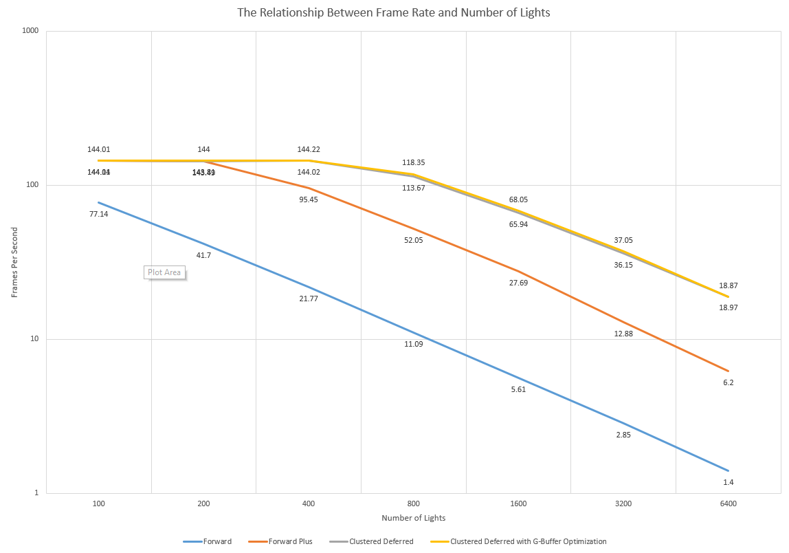

WebGL Forward+ and Clustered Deferred Shading
======================

**University of Pennsylvania, CIS 565: GPU Programming and Architecture, Project 5**

* Xuanyi Zhou
* Tested on: **Google Chrome 86.0.4240.111 with `--enable-webgl2-compute-context --use-angle=gl --use-cmd-decoder=passthrough`** on
  Windows 10, i7-9750H @ 2.60GHz 32GB, RTX 2060 6GB

## Demo

The scene contains 1000 lights. Click to open live demo in browser (**Note that you need to enable `webgl2-compute` in order to run the demo**).

Different debug views and Toon shading.

## Features

- Proper forward+ and clustered deferred rendering using WebGL2 compute shaders
  - Special command line flags are required to enable `webgl2-compte` contexts for chrome. Refer to https://github.com/9ballsyndrome/WebGL_Compute_shader/blob/master/README.md for how to enable `webgl2-compute` and to test if it's properly enabled.
- Debug views
  - Debug view 1: Depth/cluster visualization
  - Debug view 2: Visualization of number of lights shaded per pixel
  - Debug view 3: (Only for clustered deferred) Toon shaded view
- Toon shading, using sobel filters for edge detection
- GBuffer optimization:
  - `float16` for normal, `uint8` for albedo.
  - World position is reconstructed from depth. This is implemented from the very beginning, so no performance comparison is given.

## Performace Analysis

The major factor that impacts rendering performance is the number of lights - see the graph above for details, or `data.xlsx` for raw data. Specifically, the number of frames per second scales linearly with the number of lights. Since the scene is relatively small, any increase in the number of lights will also cause the number of lights that affect a specific pixel to increase accordingly.

In general, the clustered-deferred algorithm performs better than the forward+ algorithm, which in turn performs better than the pure forward algorithm. It can be seen from the debug view that both the cluster-deferred algorithm and the forward+ algorithm effectively reducese the number of lights that need to be visited during computation. To achieve the same memory footprint, the clustered-deferred algorithm uses a far coraser grid which results in increased number lights being visited for a large number of pixels compared to forward+. However, the clustered-deferred algorithm is able to differentiate between pixels in the same cluster with different depths and use different sets of lights, thus avoiding the worse-case scenario for forward+ around the edges of foreground objects, which is a bottleneck for the algorithm. The clustered-deferred algorithm can handle 1600 point lights while still maintaining a framerate above 60 FPS.

One G-buffer optimization I implemented is changing the albedo texture to `uint8` and the normal texture to `float16`. Since the rendering process is compute-bound, this change has very little impact on performance, as shown in the graph. However, it does save a considerable amount of memory.

I've also implemented Toon shading. The shader quantizes the final color, and filters normal and depth using Sobel filters for edge detection. Although this requires lots of texel fetches, in the end its performance impact is still minimal due to the algorithm being compute-bound. Since the performance difference is negligible, detailed analysis is omitted.

## Credits

* [Three.js](https://github.com/mrdoob/three.js) by [@mrdoob](https://github.com/mrdoob) and contributors
* [stats.js](https://github.com/mrdoob/stats.js) by [@mrdoob](https://github.com/mrdoob) and contributors
* [webgl-debug](https://github.com/KhronosGroup/WebGLDeveloperTools) by Khronos Group Inc.
* [glMatrix](https://github.com/toji/gl-matrix) by [@toji](https://github.com/toji) and contributors
* [minimal-gltf-loader](https://github.com/shrekshao/minimal-gltf-loader) by [@shrekshao](https://github.com/shrekshao)
* https://github.com/9ballsyndrome/WebGL_Compute_shader
