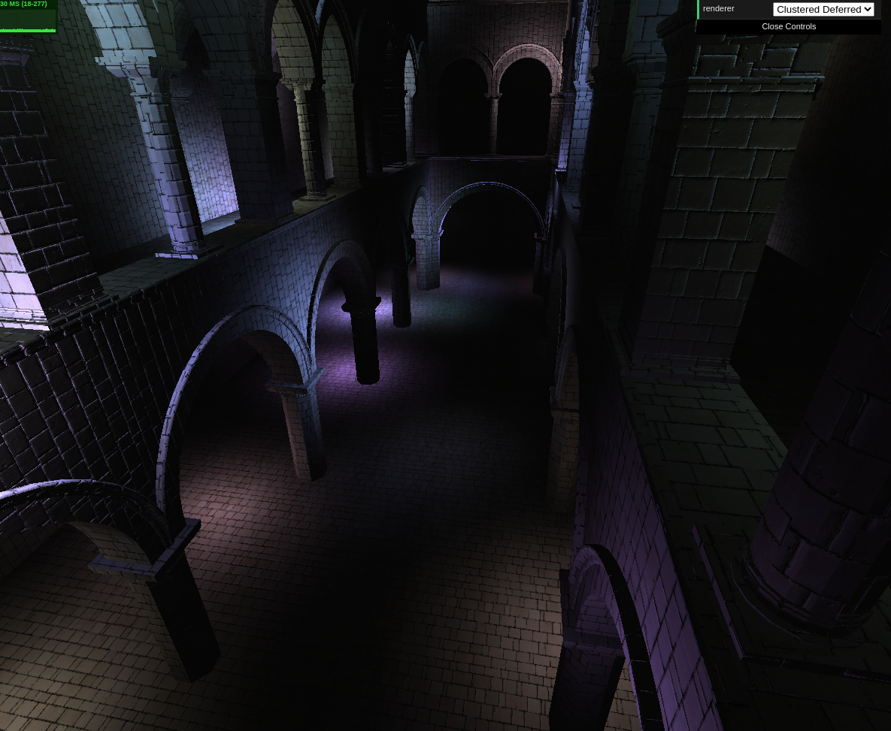
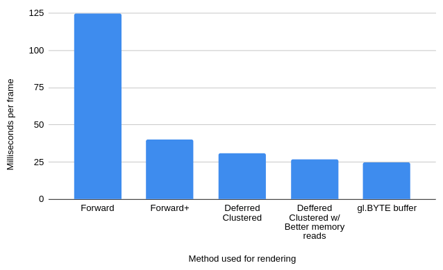
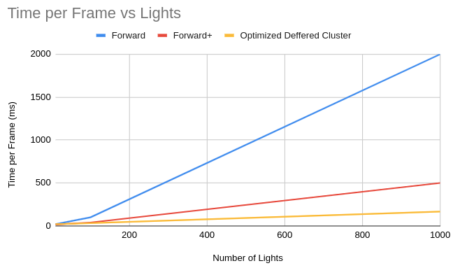
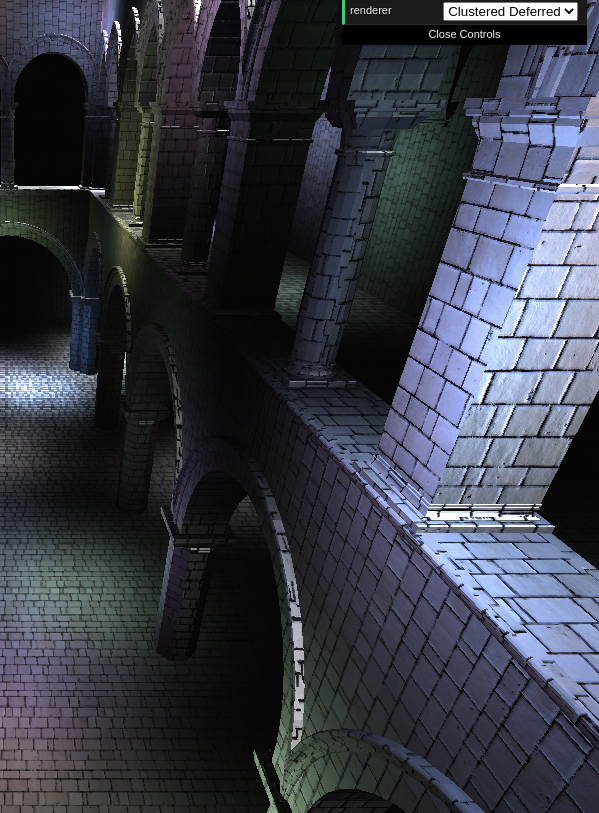

WebGL Forward+ and Clustered Deferred Shading
======================

**University of Pennsylvania, CIS 565: GPU Programming and Architecture, Project 5**

NAME: CHETAN PARTIBAN 
Browser: Google Chrome 
Tested on Ubuntu 18.4, i7-6700HQ @ 2.60 GHz 16Gb, integrated graphics (Personal Laptop) 

### Live Online

### Demo Video/GIF

### Project Summary

In this project, I have implemented Forward+ and Deferred Cluster style rendering via WebGL to explore how clustering can be used to reduce computational intensity for scenes with lots of geometry and lighting. I also implemented som optimizations such as improved memory reads and gbuffer optimizations such as reducing memory size to Bytes from Floats and reducing the number of buffers by squeezing in extra values. I found that most of the improvements came from improving the algorithm as opposed to micro-improvements within the algorithm. Here is a quick summary of the performance of the different implementations when compared to a standard forward renderring pipeline:

I have also examined the performance of Forward, Forward+, and Deferred Cluster shading at different numbers of lights. We can see that Forward+ and Deferred Clusterred rendering scale much better with the number of lights than a naive forward implementation. Further, we can see that defferred cluster seems to do better than Forward+ especially for situations with multiple lights.

I also implemented Blin-Phong specular reflections that can be utilized in the clustered-deferred implementation at significant computational cost (since it requires extra computation for every light at every pixel). With it enabled, I see framerates drop from ~40 fps to ~36. We can see it in this picture, where the nearby surfaces contain a strong shiny reflectance:

### Credits

* [Three.js](https://github.com/mrdoob/three.js) by [@mrdoob](https://github.com/mrdoob) and contributors
* [stats.js](https://github.com/mrdoob/stats.js) by [@mrdoob](https://github.com/mrdoob) and contributors
* [webgl-debug](https://github.com/KhronosGroup/WebGLDeveloperTools) by Khronos Group Inc.
* [glMatrix](https://github.com/toji/gl-matrix) by [@toji](https://github.com/toji) and contributors
* [minimal-gltf-loader](https://github.com/shrekshao/minimal-gltf-loader) by [@shrekshao](https://github.com/shrekshao)
