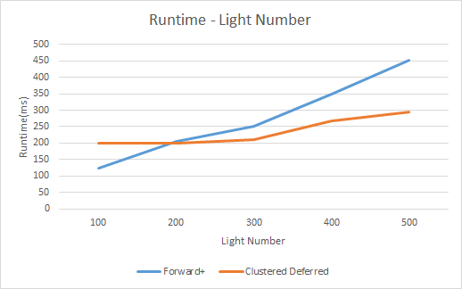
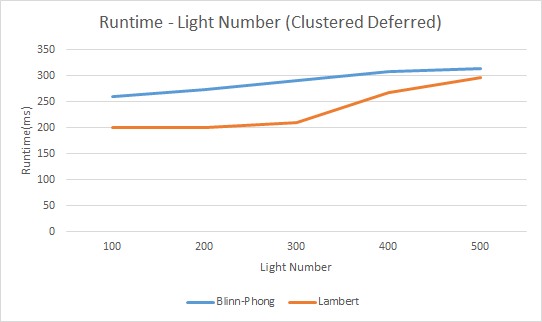

WebGL Forward+ and Clustered Deferred Shading
======================

**University of Pennsylvania, CIS 565: GPU Programming and Architecture, Project 5**

* Szeyu Chan
  * [LinkedIn](https://www.linkedin.com/in/szeyuchan11/)
* Tested on: Windows 10, i7-10510U @ 1.80GHz 16GB, MX250 2048MB (Personal Laptop)

### Live Online

https://asteriskchan.github.io/Project5-WebGL-Forward-Plus-and-Clustered-Deferred/

### GIF

### Features
* Forward+ Rendering
* Clustered Deferred Renderring
* Deferred Blinn-Phong shading

### Performance
#### Light Number
  
We can find that with the increase of light number, the clustered deferred method has a better performance. It is mainly because when the total light number is big, the light number in each cluster also increases, which is still expensive for forward+ rendering. While when the light number is small, the cost of sending buffers cannot be negligible in deferred rendering, so its performance is worse than forward+ rendering.

#### Blinn-Phong Shading
  
We test lambert shading and Blinn-Phong shading using clustered deferred rendering. Lambert shading can always be more efficiency because of its less computation. 

### Credits

* [Three.js](https://github.com/mrdoob/three.js) by [@mrdoob](https://github.com/mrdoob) and contributors
* [stats.js](https://github.com/mrdoob/stats.js) by [@mrdoob](https://github.com/mrdoob) and contributors
* [webgl-debug](https://github.com/KhronosGroup/WebGLDeveloperTools) by Khronos Group Inc.
* [glMatrix](https://github.com/toji/gl-matrix) by [@toji](https://github.com/toji) and contributors
* [minimal-gltf-loader](https://github.com/shrekshao/minimal-gltf-loader) by [@shrekshao](https://github.com/shrekshao)
