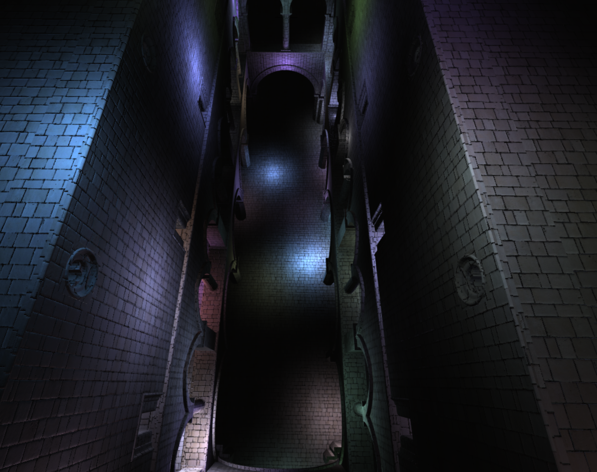
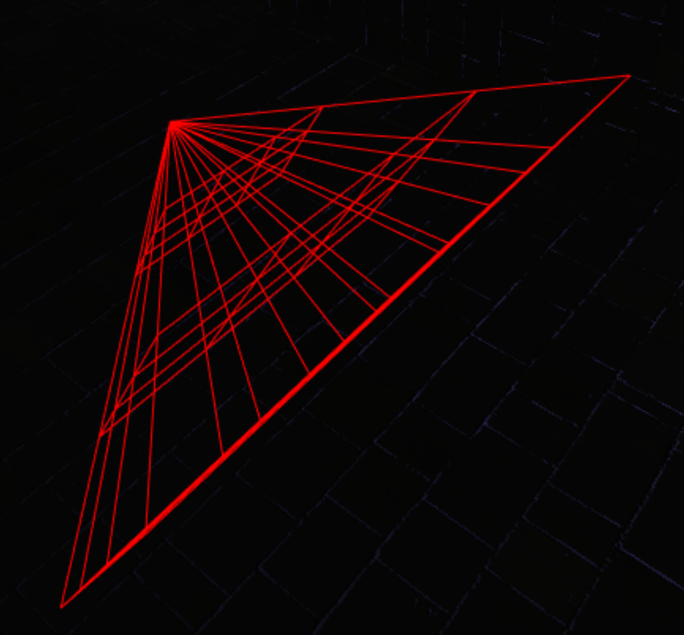
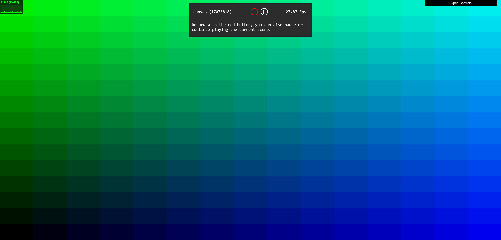
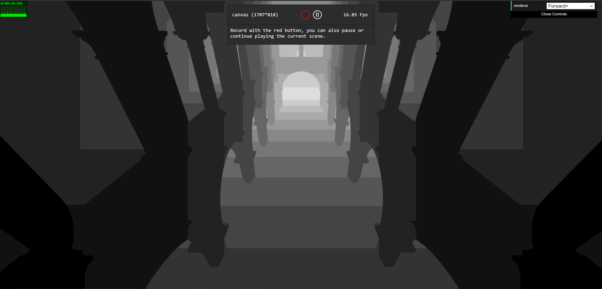
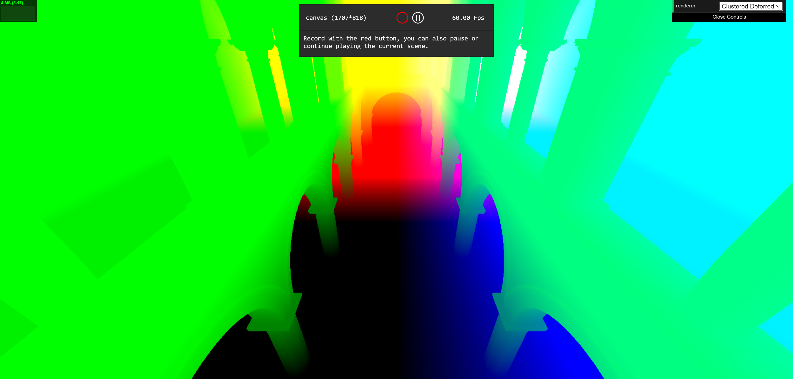
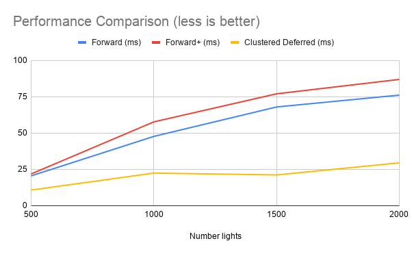

WebGL Forward+ and Clustered Deferred Shading
======================

**University of Pennsylvania, CIS 565: GPU Programming and Architecture, Project 5**

* Janine Liu
  * [LinkedIn](https://www.linkedin.com/in/liujanine/), [personal website](https://www.janineliu.com/).
* Tested on: Windows 10, i7-10750H CPU @ 2.60GHz 16GB, GeForce RTX 2070 8192 MB (personal computer)

### Live Online

This project tackles various methods of shading a scene with numerous moving lights, starting with **single-pass Forward Shading**. Forward Shading iterates through all of the visible objects in the scene, where each object finds the lights that affect it and shades itself accordingly. This is more efficient than having a multi-pass version, in which the lights are iterated through *first*, making each light finding the same visible objects to shade them (multiple passes over the same objects, hence "multi-pass"). Two optimized versions of this shading — **Forward+** and **Clustered Deferred** — are implemented and analyzed below.

## Performance Analysis Methods

Outside debug mode, my computer runs all three modes extremely fast (each renderer runs with 1-3ms, as indicated by the window in the top left corner), so I have to use debug mode in order to get substantial analyses. To analyze this data, I used Google Chrome's built-in performance tools, which allows me to view the function calls in a `tick()` of the program.

This allows me to throttle my CPU for a 6x slowdown, which helps expose the time differences between the different methods. I average the times of the first ten `tick()` calls to estimate the average of the whole run.

## Forward+ Shading

**Forward+** has the same qualities as regular Forward shading, but it also employs a data structure that preprocesses the positions of the lights before the scene is rendered. The screen is divided into three-dimensional slices, where each slice in *world* space is a subfrustum of the camera's frustum.

| X/Y-slices | Z-slices |
|----------|--------|
|  |  |

These frustums keep track of what lights they intersect with at every update. I implemented two ways of processing this data, with one running substantially faster than the other.

### Per-Frustum Iteration (Naive)

The naive method iterates through all of the subfrustums and checks every light against that frustum. If the light is in the frustum, then add it to the list of light indices of that frustum. This data is assembled across all of the frustums and passed to the fragment shader, where each visible point evaluates what frustum is in and thus what lights it may be affected by.

Clearly, this is inefficient because there will be frustums that do not intersect with any lights, but are checked regardless — a costly operation with the numerous lights in the scene.

### Per-Light Iteration (Optimized)

The optimized method uses the spherical shape of the light to determine it's axis-aligned bounding box. This bounding box can be taken from world space into screen space, and then sorted into the frustums that directly intersect it. Only the frustums that intersect the bounding box of these lights will be checked against this light in the shader.

Indeed, this showed dramatic improvement from the per-frustum method; while it took a range of 45-50 ms for one tick to finish with the naive method, it only took 5-7 ms for the optimized method's tick.

## Clustered Deferred Shading

**Clustered Deferred** shading builds off of the clustering system in Forward+, but also uses a preprocess pass to store the positions, normals, and colors of visible objects. This limits the shader's work to only *visible* fragments. Although this works well for scenes with multiple meshes at varying depths, it is difficult to make it work with translucency and other materials, and it increases memory bandwidth due to the extra storage.

| Position Buffer | Normal Buffer |
|----------|----------|
|  |  |

## Performance Comparison

Surprisingly, the Forward+ renderer did *worse* than the Forward render. The CPU overhead of putting the lights into clusters must not be worth the saved time on the GPU. I believe this is because in my implementation, I iterate over all of the slices twice — once to initialize their lists of lights, and once to push all the lights into the buffer for shading. If I were to compress this into a better looping system, perhaps I could reduce the CPU time enough to make it on par with, if not better than the regular Forward render.

As expected, though, the Clustered Deferred renderer worked significantly better than both the Forward and Forward+ renderers.

## Toon Shader

I created a toon shader by mapping the Lambertian product to a five-tone map, then applying diagonal lines over darker areas of the image to simulate cross-hatching. Because this is essentially a post-processing shader that does not rely on the number of lights in the scene, the added workload is a constant factor.

### Credits

* [Three.js](https://github.com/mrdoob/three.js) by [@mrdoob](https://github.com/mrdoob) and contributors
* [stats.js](https://github.com/mrdoob/stats.js) by [@mrdoob](https://github.com/mrdoob) and contributors
* [webgl-debug](https://github.com/KhronosGroup/WebGLDeveloperTools) by Khronos Group Inc.
* [glMatrix](https://github.com/toji/gl-matrix) by [@toji](https://github.com/toji) and contributors
* [minimal-gltf-loader](https://github.com/shrekshao/minimal-gltf-loader) by [@shrekshao](https://github.com/shrekshao)

**Math References**

* [Plane equations](http://www.songho.ca/math/plane/plane.html?fbclid=IwAR0qZN0UzxIcByyhQivKEInBdeMxfxHjyu_jUPumApHeQe9-R2-IPrc_Y04) by Song Ho Ahn
* [Frustum and sphere intersection](https://www.flipcode.com/archives/Frustum_Culling.shtml) by Dion Picco
* [Help with screen to world transformations](https://gamedev.stackexchange.com/questions/56725/calculate-object-coordinates-from-window-coordinates-using-inverse-projection-ma) by Daniel Flassig

**Toon Shader References**
* [Unity Toon Shader Tutorial](https://roystan.net/articles/toon-shader.html)
