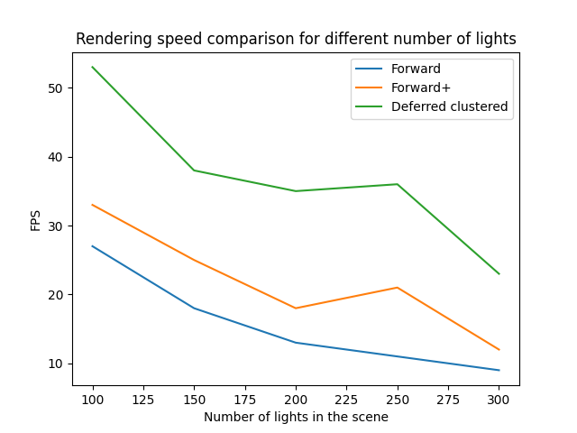

WebGL Forward+ and Clustered Deferred Shading
======================

**University of Pennsylvania, CIS 565: GPU Programming and Architecture, Project 5**

* Shenyue Chen
  * [LinkedIn](https://www.linkedin.com/in/shenyue-chen-5b2728119/), [personal website](http://github.com/EvsChen)
* Tested on: MacOS, 2.6 GHz 6-Core Intel Core i7, Radeon Pro 555X 4 GB

### Demo Video/GIF
[Demo video on Youtube](https://youtu.be/LtUG5TZRfDE)

### Features
* Forward+ rendering
* Clustered deferred rendering
* Blinn-phong specular shading in deferred rendering
* Two-component normal

### Performance analysis
#### Comparison between the three methods
Generally, in terms of the rendering speed, Forward < Forward+ < Deferred Clustered in all cases. I measure the FPS for the three methods in relation to the number of lights in the scene.

#### Using 2-component normal
Using 2-component normal will reduce the space occupied by the G-Buffer. But due to the extra computation worload it introduces, it may not be able to improve the performance significantly.

### Credits

* [Three.js](https://github.com/mrdoob/three.js) by [@mrdoob](https://github.com/mrdoob) and contributors
* [stats.js](https://github.com/mrdoob/stats.js) by [@mrdoob](https://github.com/mrdoob) and contributors
* [webgl-debug](https://github.com/KhronosGroup/WebGLDeveloperTools) by Khronos Group Inc.
* [glMatrix](https://github.com/toji/gl-matrix) by [@toji](https://github.com/toji) and contributors
* [minimal-gltf-loader](https://github.com/shrekshao/minimal-gltf-loader) by [@shrekshao](https://github.com/shrekshao)
