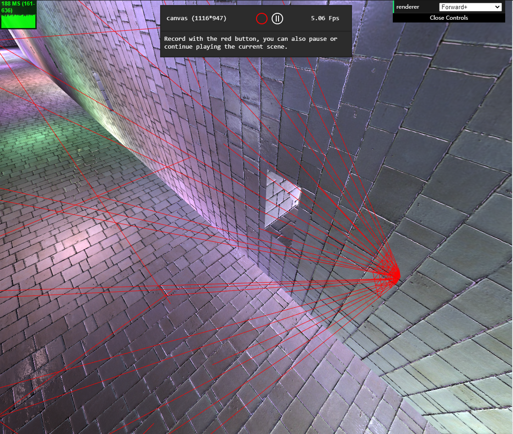
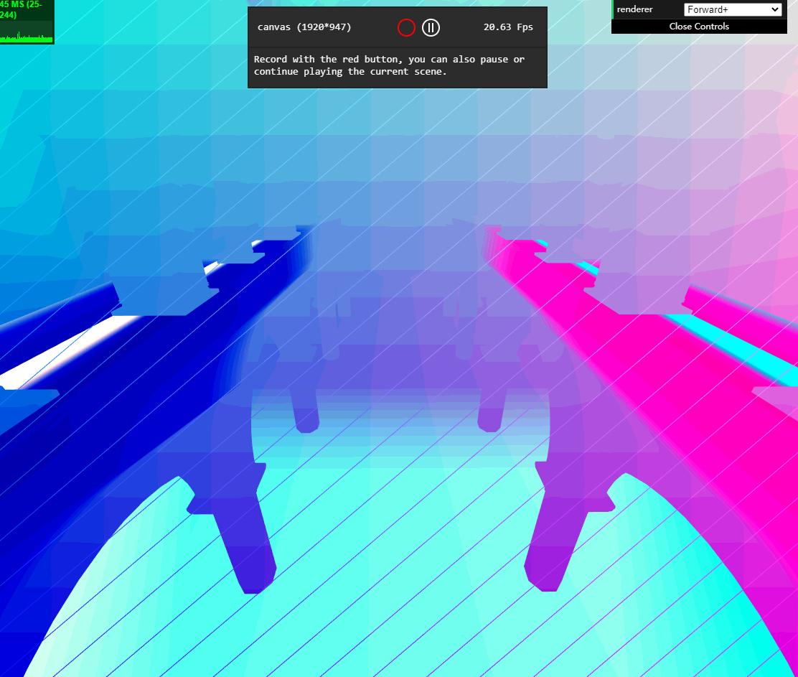
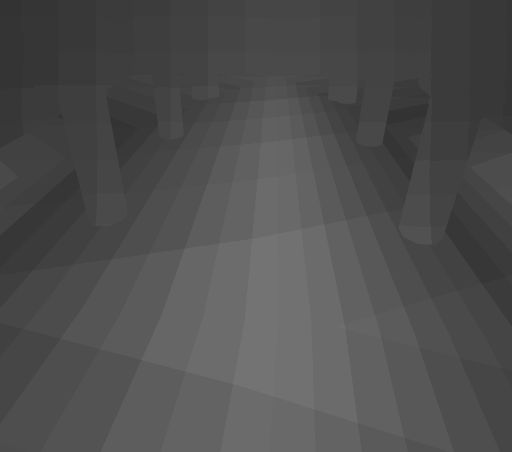
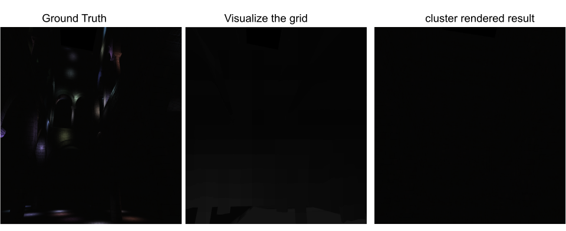
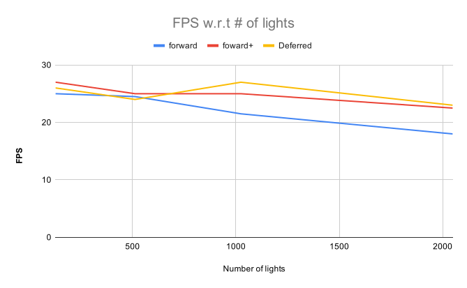

WebGL Forward+ and Clustered Deferred Shading
======================

* **University of Pennsylvania, CIS 565: GPU Programming and Architecture, Project 5*
  
  * Ling Xie
    * [LinkedIn](https://www.linkedin.com/in/ling-xie-94b939182/), 
    * [personal website](https://jack12xl.netlify.app).
  * Tested on: 
    * Windows 10, Intel(R) Xeon(R) CPU E5-2650 v4 @ 2.20GHz 2.20GHz ( two processors) 
    * 64.0 GB memory
    * NVIDIA TITAN XP GP102
  
  Thanks to [FLARE LAB](http://faculty.sist.shanghaitech.edu.cn/faculty/liuxp/flare/index.html) for this ferocious monster.

### Live Online

[link](https://jack12xl.github.io/Project5-WebGL-Forward-Plus-and-Clustered-Deferred/).

### Demo Video/GIF

[](TODO)

### Intro

In this project, we implement the deferred shading algorithm. Deferred shading basically refers to defer the shading stage until necessary. The shading could utilize the depth and light position distribution to cull unnecessary calculation. 

#### Light Culling

From [this](http://www.aortiz.me/2018/12/21/CG.html#tiled-shading--forward):

```c++
//Light culling
for cluster in clusterArray
   for light in scene
      if lightIncluster(cluster, light)
          cluster += light
```

##### intro to light culling

Since most of our time contributes to this, so here we would like to introduce the following in detail:

##### The way we implement

We choose to uniformly divide the frustum from NDC plane, then map the divided grid back to world space as frustum. The pipeline for assigning each light to its frustum would be

```bash
NDC (x, y, z ranged from [-1,1] ) space
to
clip space (x, y, z, w)
to 
view space
to 
world space
```

In this way it could largely **reduce** the calculation in fragment shader. Because here we only need to calculate fragment position according to the NDC space. Compared to **directly dividing the frustum in world or view space,** here we could save memory and computation like

- buffer for `whole frustum position(include near, far, vertices' position) `in view or world space, 
- deciding the frustum for the frag_coordinate is nontrivial, while the grid in NDC space is mush easier.

which could both save time for shader memory and computation. (Due to time constrain, we did not implement and compare each method).

However, this method still introduce some sort of headaches and drawbacks:

- The most technically challenging key point is how to recover the **W** component of NDC space since the  **W** component is lost.
- Mapping `NDC Z component` to view space is **non-linear**. To make the frustum uniform in Z-side, we need to explicitly design the way we split the NDC Z component. 
  - Here we directly make the Z slice to one, literally only slicing the X, Y component. 
- Last but not least, the **three.js** API is not that handy and prone to bugs. Also, switching `three.Vector ` between  `native javascript array` ,`glsl.vec` is not straight and disappointingly tedious.


To demonstrate the frustum assigning is implemented about right, here we show

1. The frustum of the initial camera pose. If we slice uniformly on NDC plane, the size on world is non-linear.



2. The frustum normal. To see whether the normal is about right. 
   - The red line shows the frustum edge.
   - The green line shows the normal direction.


3. Here we wanna visualize which grid each fragment is in. 

- The color shows current which grid current fragment is placed
- The line is plot from each frustum `near bottom left` to `far up right`. Notice the line nearly cross from grid left down to up right, which is intuitively correct.



4. How many light did each grid occupy?

The brighter the pixel is, the more light current pixel is applied




However, the current light culling algorithm wasn't implemented 100% accurate. 



In the **left most** image shows the forward rendered algorithm as ground truth.

The **right most** shows the forward plus algorithm rendered by frustum cluster. 

We noticed when we tried to turn up, the cluster start to miss the light. Since under other circumstances the results are mostly the same, we think this is most due to the intersection part, where we set `three.js plane` to construct the `three,frustum`. The internal implementation is different from what it demonstrates in documentation.

### Effect

##### Phong VS Blinn-Phong


**Phong reflection** is a local illumination model devised by **Bui Tuong Phong** and can produce a certain degree of realism in three-dimensional objects by combining three elements - diffuse, specular and ambient lighting for each considered point on a surface.

Here we implement **Blinn-Phong**, Normal **Phong**. 

- Theoretically, **Blinn Phong** takes less time to calculate. But this phenomenon does not appear that evident here. 
- Visually, the original **Phong** looks more smooth and visually realistic then **Blinn-Phong** under the same parameter.

Empirical evidence shows that **phong** did not introduce much calculation.

### Optimizations & Performance

##### Performance with different number of lights



Here we compare each method FPS w.r.t the number of lights in the scene. For fairness, the **Forward+** and **Deferred** shading both use `16 x 16 x 1` grid. 

As showed in the diagram, when the number of light goes up, the fps shows Deferred > forward + > forward. 

Compared to forward +, deferred shading takes a higher memory footprint. For example, it takes extra G-buffer to store the position, normal and albedo. The benefit is that from the depth pass we could filter out unnecessary shading calculation. 

In general, the **forward plus** and **deferred shading** should be much faster than the forward algorithm. We think the main performance bottleneck lies in the light culling. 

We would do sphere and frustum intersection  for each shape, which would neutralize the benefit from culling light into each frustum 

```C++
for each LightSphere S
    for each Frustum F
    	if Intersect(S, F):
			....
```

###### Possible improvement

We think the improvement could be we further divide the already divided frustums into several big chunks and do intersection.  

##### G-buffer optimizations

###### vec2 normal (vec3 -> vec2)

We use the same technique as in our [project 4](https://github.com/Jack12xl/Project4-CUDA-Denoiser#1-gbuffer-optimization), which basically map the coordinate from sphere to oct. We implement its function in [optimize.glsl]().


We do not witness a significant performance change from this. Theoretically, this would introduce more computation but could save memory for **G-buffer**. Also, we seam the encoded-normal to other G-buffer, which could even save more memory as it directly remove one vec4 G-buffer.


### Credits

* [Three.js](https://github.com/mrdoob/three.js) by [@mrdoob](https://github.com/mrdoob) and contributors
* [stats.js](https://github.com/mrdoob/stats.js) by [@mrdoob](https://github.com/mrdoob) and contributors
* [webgl-debug](https://github.com/KhronosGroup/WebGLDeveloperTools) by Khronos Group Inc.
* [glMatrix](https://github.com/toji/gl-matrix) by [@toji](https://github.com/toji) and contributors
* [minimal-gltf-loader](https://github.com/shrekshao/minimal-gltf-loader) by [@shrekshao](https://github.com/shrekshao)
* [Map NDC to clip space](https://www.khronos.org/opengl/wiki/Compute_eye_space_from_window_space)
