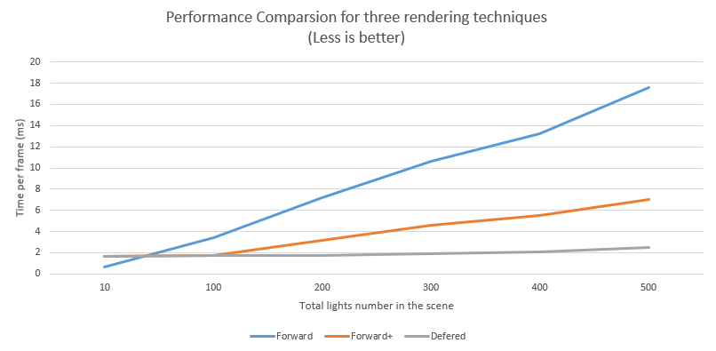
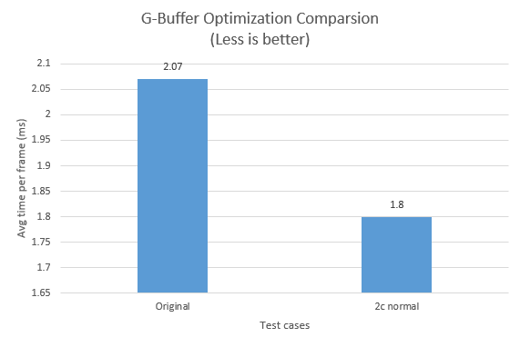
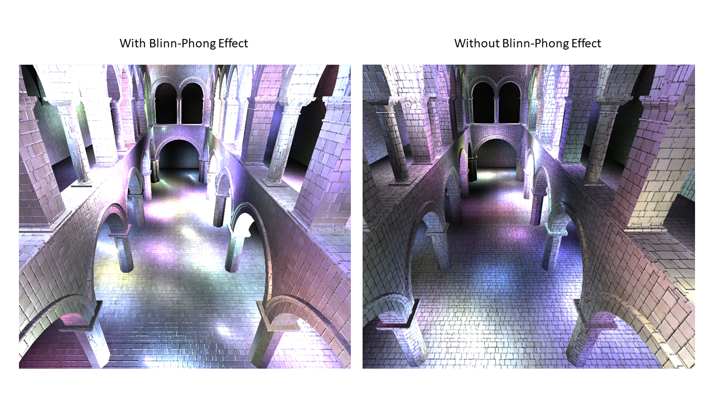
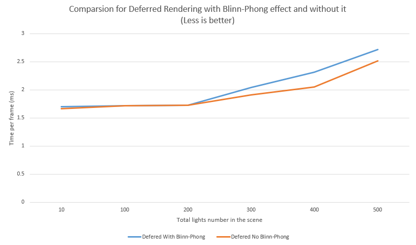
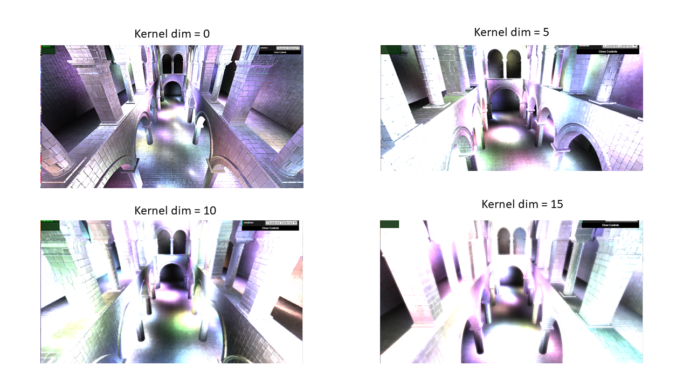
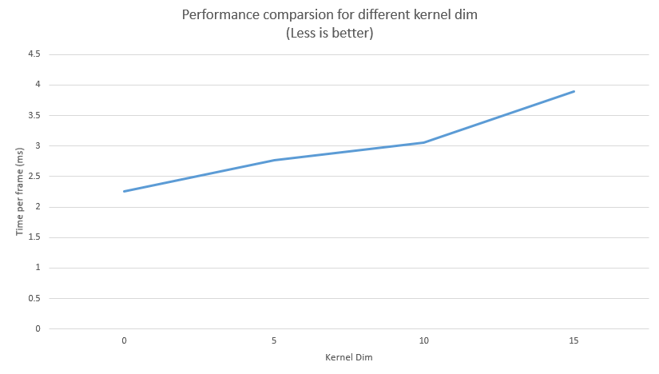

WebGL Forward+ and Clustered Deferred Shading
======================

**University of Pennsylvania, CIS 565: GPU Programming and Architecture, Project 5**

* Jiarui Yan
* Tested on: **Google Chrome** on
  Windows 10, i7-9700k, RTX 2070 SUPPER (Personal desktop)

### Live Online

### Demo Video/GIF

### Features

* Forward rendering

* Forward+ rendering

* Clustered deferred rendering

* Deferred Blinn-Phong shading (diffuse + specular) for point lights

* Bloom using post-process blur (Gaussian)

* G-Buffer Optimization

* Performance analysis

### Performance & Analysis

#### Compare three shading methods

In this project, there are three rendering techniques: Forward, Forward+ and Clustered Deferred. One thing that needs attention is that for the Clustered Deferred renderering case this is a version after g-buffer optimization. In general, for the Forward one, renderer would loop over all the triples of light and material combination for each object. However, with clustered rendering method in Forward+ and Clustered Deferred renderers, we can use frustrum to determine whether a perticular light is in the frustrum and in this way we can determine whether the renderer wants to check this material and light combination. Therefore, we can expect that with lots of light, methods using Clustered technique would perform better than Forward. Then, forward+ would shader all the fragments, even though lots of them would be occluded by z-buffer tests. Therefore, defered shading comes. It separates the geometry and shading process. As a result, it requires more passes to shader one pic, but it can give more performance advantages if there are lots of lights and occluded shaded fragments. In addition, for this experiment, their data are collected on just diffuse material type and the frame data is collected from Chrome Profiling tool. I select 10 frames in the profiling tool and plot the average frame time out. Here is the comparision for three different methods.

As we can see from the graph above, at first when the light number in the scene is not large enough, the performance of forward rendering would be better than the other two techniques. This is caused by the fact that when the light number is small, the disadvantage of using more rendering passes would appear. So, if there are only a small amount of light sources in the scene, we would want to use Forward method. However, when the light number increases, we would want to use Deferred Shadering.

#### G-Buffer Optimization for Deferred Shading

In this part, I implement Spherical Coordinates for G-Buffer normal in the world space. As a result, a normal can be encoded into 2 floats and be stored with a position and color. In this way, we only need two g-buffer to pass data for deferred shadering. Meanwhile, there are 400 lights in the tested scene. Here is a comparsion between these two implementation.

As we can see, 2-element normal can help to improve the performance of the defered shadering. Even though the G-Buffer size is reduced, the cost of decoding and encoding is increased. However, from our experiment, its disadvantage doesn't really affect the result of it. 

#### Blinn-Phong effect analysis

Here is a comparsion done on Deferred Shading renderer between the renderer with Blinn-Phong effect and without this effect. This effect basically is used to simulate specular materials. 

Here is a comparsion between rendering with Phong effect and without Phong effect.

Here is an analysis for the rendering with this effect and without it as I increase the number of light.

As we can see from the plot above, the performance of the renderer without Blinn-Phong effect always performs better than the one with it. This fulfills our expectation, because diffuse effect is default and Phong effect always needs more computation. 

#### Bloom effect analysis

Bloom effect is a post-processing effect that can strength the light parts of a scene by using Gaussian Blur techniques. In this project, this is achieved based on the previous rendering result. In short, by inputing the Clustered deferred rendering result as a texture to the post-processing shader, we can use Gaussian Blur to strength the lightness for each fragment. I constructed Gaussian Kernel in each fragment shader and use it to make the Bloom effect.

Bloom effect is implemented only on Clustered Deferred renderer and it is turned on by default. In addition, all the perforamnce analysis that is relevant to Clustered Deferred renderer would automatically be done by just using diffuse term. Therefore, if you want to use this project to get the performance data that I present here. Please remember to disable the special effects in the Clustered Deferred renderer. Besides, there is a variable named 'kernelDim' and you can use this variable to adjust the size of the Gaussian kernel.

Here are rendering results comparsion for different kernel size.

As we can see from the comparsion above, with a larger kernel, the bloom effect would be more obvious.

Here is the perforamance difference for different kernel size.

As we can see, large kerel size would heavily affect the performance of it, because each kernel would be constructed in every fragment shader and be looped. Therefore, its affect is obvious.

### Credits

* [Compact Normal Storage](https://aras-p.info/texts/CompactNormalStorage.html)
* [Three.js](https://github.com/mrdoob/three.js) by [@mrdoob](https://github.com/mrdoob) and contributors
* [stats.js](https://github.com/mrdoob/stats.js) by [@mrdoob](https://github.com/mrdoob) and contributors
* [webgl-debug](https://github.com/KhronosGroup/WebGLDeveloperTools) by Khronos Group Inc.
* [glMatrix](https://github.com/toji/gl-matrix) by [@toji](https://github.com/toji) and contributors
* [minimal-gltf-loader](https://github.com/shrekshao/minimal-gltf-loader) by [@shrekshao](https://github.com/shrekshao)
