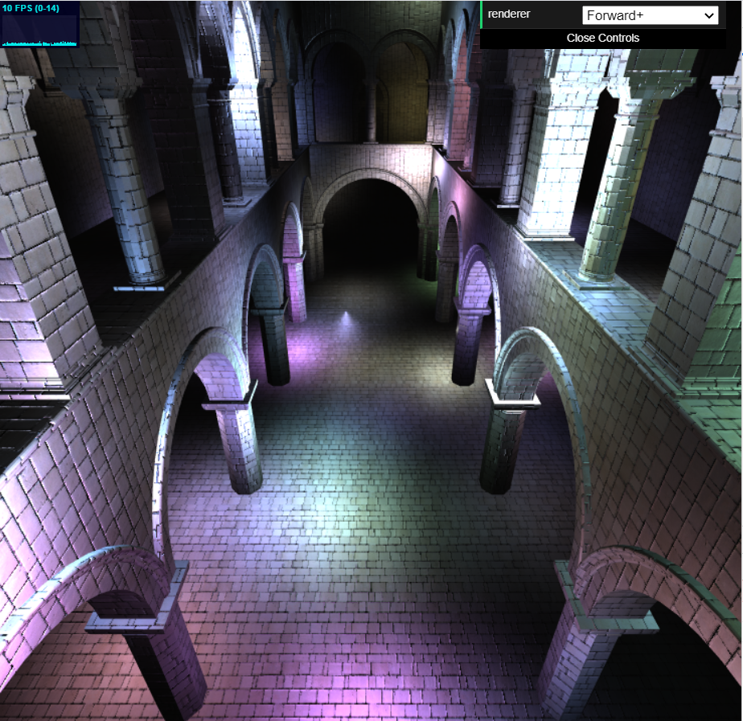
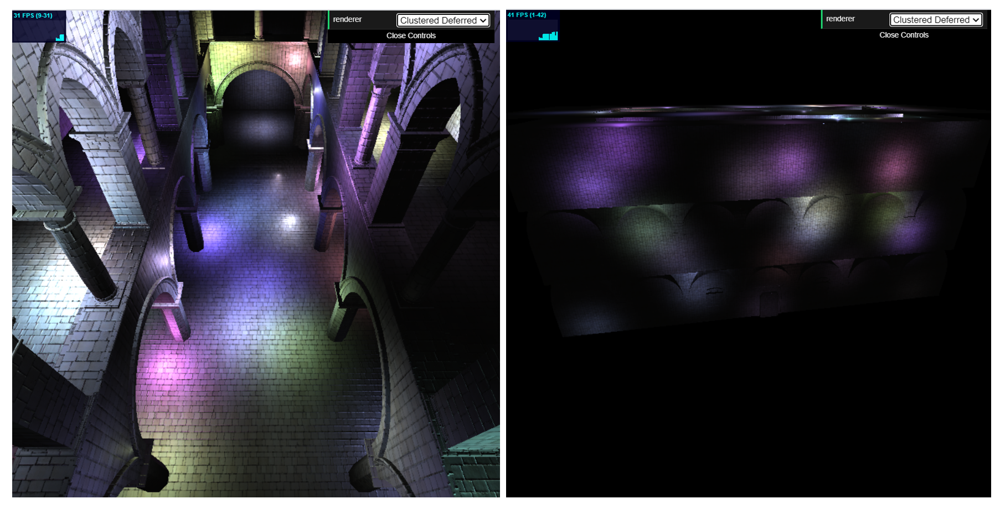

WebGL Forward+ and Clustered Deferred Shading
======================

**University of Pennsylvania, CIS 565: GPU Programming and Architecture, Project 5**

* Jilin Liu
  * [LinkedIn](https://www.linkedin.com/in/jilin-liu-61b273192/), [twitter](https://twitter.com/Jilin18043110).
* Tested on: Windows 10, i7-8750H @ 2.20GHz, 16GB, GTX 1050Ti 4096MB (personal)

**This repo contains a WebGL implementation of a basic Forward Plus Rendering and Clustered Deferred Rendering.**

## Live Online

## Demo Video/GIF

## Features
1. Forward+ Rendering
2. Clustered Deferred Rendering

### Forward+ Rendering
We split the camera frustum into sub-frustums to act as light clusters. Each cluster will record the lights which may have potential contribution to objects in that cluster. Then in the shader, we can determine the cluster that a given point belongs to and then unpack lights from that cluster to avoid iterating the whole bunch of lights in the scene.

### Clustered Deferred Rendering
We can defer the shading stage by first storing the scene information to g-buffer and then use it later in the pixel shader to avoid per-fragment calculations. Again, we can use light clusters to reduce the cost of evaluating lights.

The number of lights now has different influences on these three rendering methods.

| Number of Lights | 60 | 125 | 250 |
|---|---|---|---|
| Forward | 53ms | 100ms | 213ms |
|---|---|---|---|
| Forward+ | 60ms | 154ms | 318ms |
|---|---|---|---|
| Clustered Deferred | 26ms | 67ms | 113ms |

## Credits

* [Three.js](https://github.com/mrdoob/three.js) by [@mrdoob](https://github.com/mrdoob) and contributors
* [stats.js](https://github.com/mrdoob/stats.js) by [@mrdoob](https://github.com/mrdoob) and contributors
* [webgl-debug](https://github.com/KhronosGroup/WebGLDeveloperTools) by Khronos Group Inc.
* [glMatrix](https://github.com/toji/gl-matrix) by [@toji](https://github.com/toji) and contributors
* [minimal-gltf-loader](https://github.com/shrekshao/minimal-gltf-loader) by [@shrekshao](https://github.com/shrekshao)
