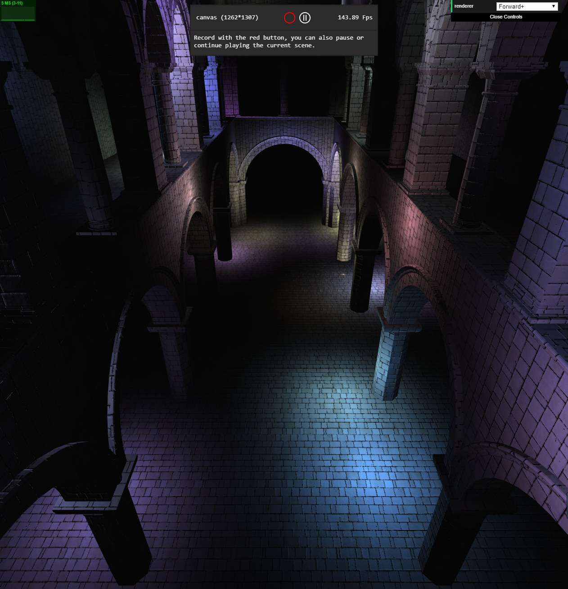
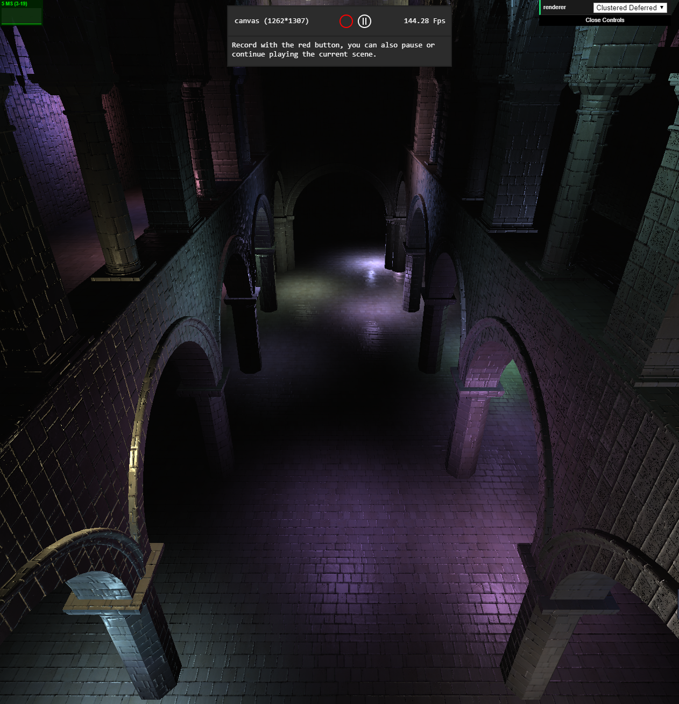
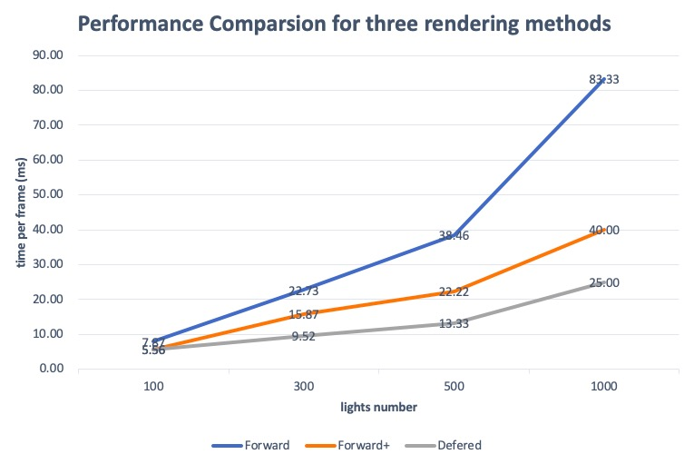
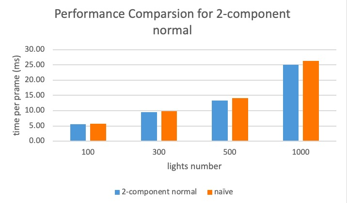

WebGL Forward+ and Clustered Deferred Shading
======================

**University of Pennsylvania, CIS 565: GPU Programming and Architecture, Project 5**

* Haoyu Sui
  	* [LinkedIn](http://linkedin.com/in/haoyu-sui-721284192)
* Tested on: Windows 10, i5-9600K @ 3.70GHz 16GB, RTX 2070 SUPER 8GB 
* SM：7.5

| Forward+ | Clustered Deferred and Blinn-Phong |
| ------------------------ | ----------------------- |
|  |  |

### Live Online

### Demo GIF

### Performance Analysis

From the figure we can see that forward+ and clustered deferred can improve performance, and as the total number of lights increases, the performance improvement becomes more obvious

**2-component normals**

According to the chart, 2-component normal does not improve performance to a large extent. I think the reason may be that although 2-component normal optimizes the use of G-Buffer and reduces its space, it also adds additional computational overhead.

### Credits

* [Three.js](https://github.com/mrdoob/three.js) by [@mrdoob](https://github.com/mrdoob) and contributors
* [stats.js](https://github.com/mrdoob/stats.js) by [@mrdoob](https://github.com/mrdoob) and contributors
* [webgl-debug](https://github.com/KhronosGroup/WebGLDeveloperTools) by Khronos Group Inc.
* [glMatrix](https://github.com/toji/gl-matrix) by [@toji](https://github.com/toji) and contributors
* [minimal-gltf-loader](https://github.com/shrekshao/minimal-gltf-loader) by [@shrekshao](https://github.com/shrekshao)
