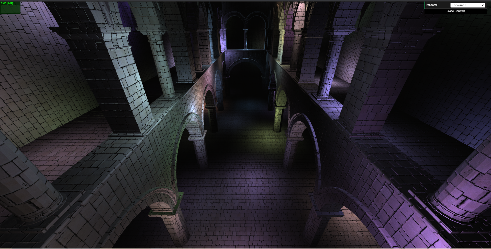
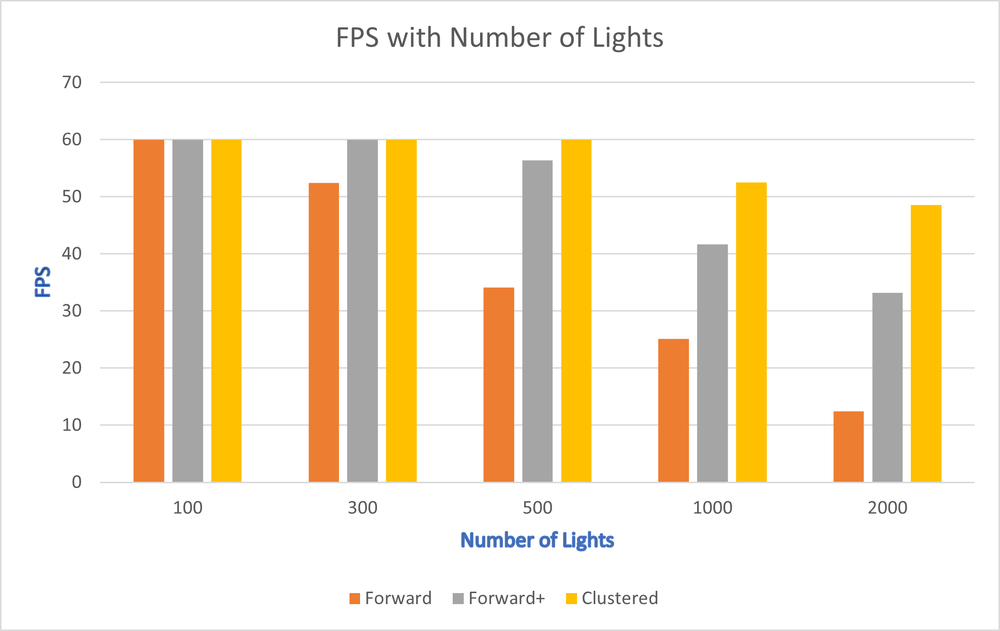
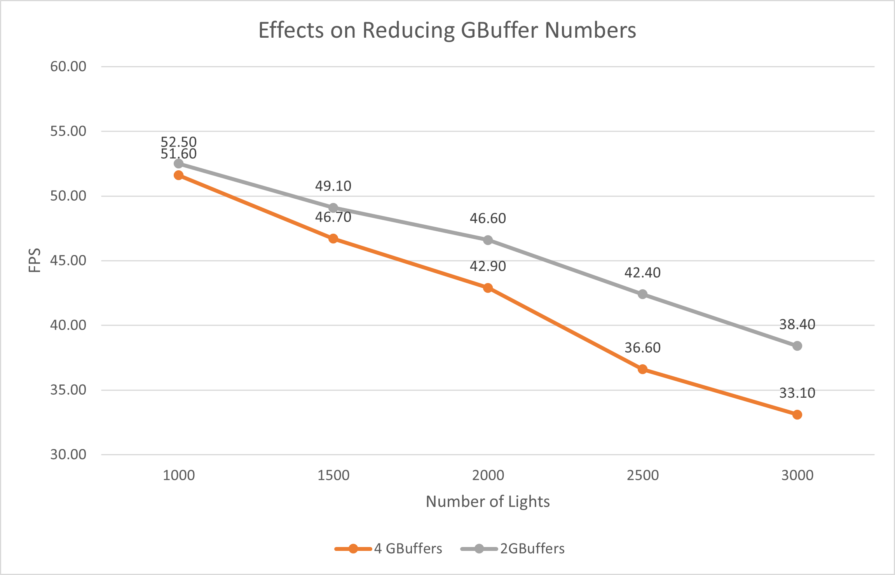

WebGL Forward+ and Clustered Deferred Shading
======================

**University of Pennsylvania, CIS 565: GPU Programming and Architecture, Project 5**

* Dayu Li
* Tested on: **Google Chrome 86.0.4240.111** on
  Windows 10, i7-10700K @ 3.80GHz 16GB, GTX 2070 8150MB (Personal laptop)  

### Live Online

### Demo Video/GIF

[]

### Features Implemented

- **Forward+**
- **Clustered**
- **Effects**
  - Implement deferred Blinn-Phong shading (diffuse + specular) for point lights.
 
 []
 
- **Optimizations**
  - Store values in vec4.
  - Reduced the number of GBuffers needed from 4 to 2.

### Performance Analysis

#### Different Shading Methods
As shown in the graph below, The clustered deferred shading can provide a consistent acceleration in terms of FPS compared to forward+ shading and forward shading. Forward+ shading is also faster than the naive forward shading. When the number of lights are huge, the effect of speeding up when using the clustered deferred shading is getting more and more obvious.

#### Optimized G-Buffer

Reducing the number of GBuffers from 4 to 2 can improve the performance of clustered shading as shown below. When the number of lights are getting larger, the improvment is more obvious.

### Credits

* [Three.js](https://github.com/mrdoob/three.js) by [@mrdoob](https://github.com/mrdoob) and contributors
* [stats.js](https://github.com/mrdoob/stats.js) by [@mrdoob](https://github.com/mrdoob) and contributors
* [webgl-debug](https://github.com/KhronosGroup/WebGLDeveloperTools) by Khronos Group Inc.
* [glMatrix](https://github.com/toji/gl-matrix) by [@toji](https://github.com/toji) and contributors
* [minimal-gltf-loader](https://github.com/shrekshao/minimal-gltf-loader) by [@shrekshao](https://github.com/shrekshao)
