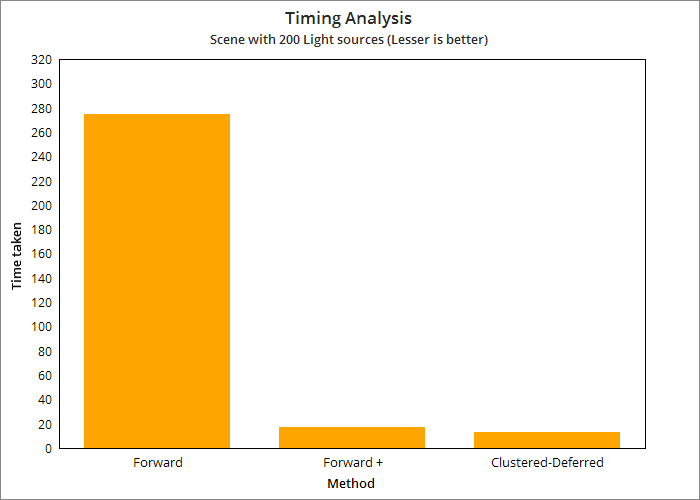
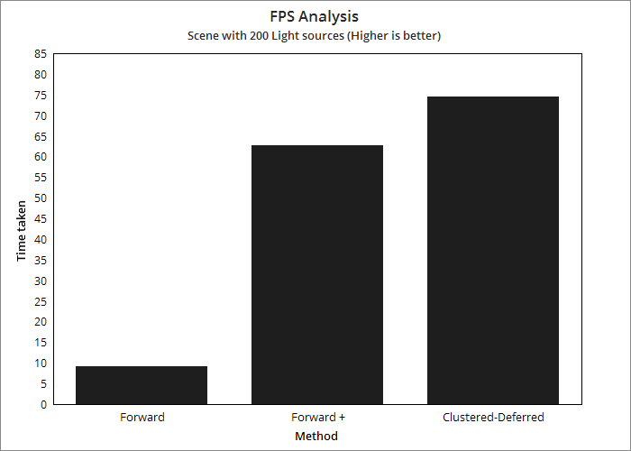
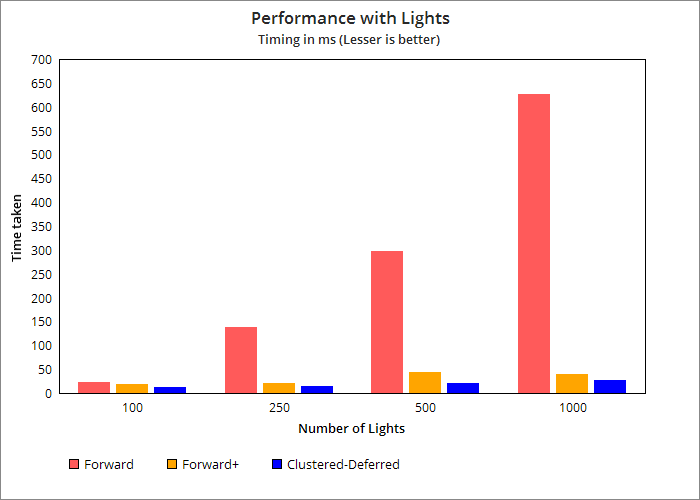
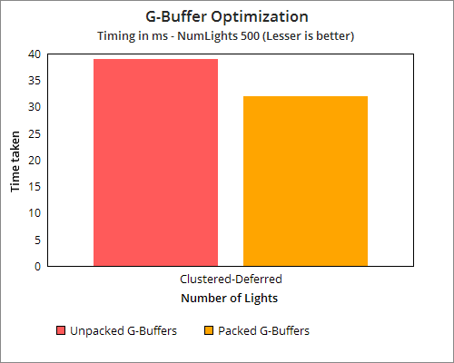
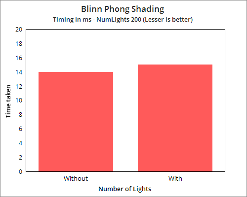
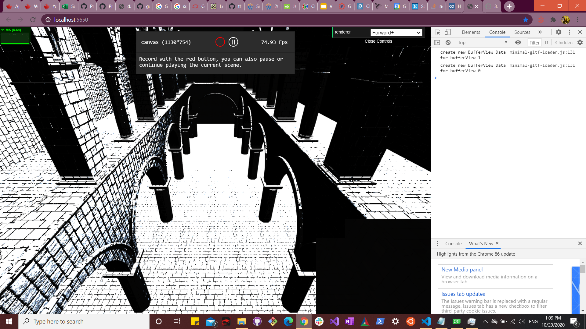
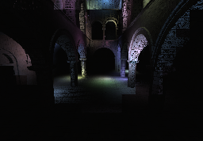

WebGL Forward+ and Clustered Deferred Shading
======================

**University of Pennsylvania, CIS 565: GPU Programming and Architecture, Project 5**

## SIREESHA PUTCHA 
	
*    [ LinkedIn ](https://www.linkedin.com/in/sireesha-putcha/)

*   [ Facebook ](https://www.facebook.com/sireesha.putcha98/)

*    [ Portfolio ](https://sites.google.com/view/sireeshaputcha/home)

*   [ Mail ](sireesha@seas.upenn.edu)

* Tested on personal computer - Microsoft Windows 10 Pro, 
Processor : Intel(R) Core(TM) i7-9750H CPU @ 2.60GHz, 2601 Mhz, 6 Core(s), 12 Logical Processor(s)
 
GPU : NVIDIA GeForce RTX 2060

## Output 

### Demo Video/GIF

](demo)

## Overview 

### Forward Renderer 
This is the basic implementation of a rendering engine. In our implementation, we draw each lit object and for each pixel drawn, we check each light to see if that 
light contributes to that pixel. As it is evident, this allows for a low of unwanted computations and leads to a higher runtime. 

### Forward Plus Renderer
In order to optimize our forward renderer, we can get rid of the checking each pixel against each light part of the algorithm. Instead, we initially stores clusters 
representing indices of lights that are present in it. In our approach, we first compute the min and max bounds of the clusters and determine the light-frustum overlap. 
Light indices are grouped based on what cluster they belong in. 
Finally, we shade the scene by checking the pixel only against the lights that might contribute to a pixel using the clusterBuffer. 

### Clustered Deferred Renderer
In deferred shading, we draw the objects in the scene into gBuffers rather than the final output frame buffer. For each pixel in the GBUffer, we check to see which lights 
contribute to the scene. This approach is similar to forward plus. 

## Features Implemented 

- Forward+

	- Built a data structure to keep track of how many lights are in each cluster and what their indices are
	- Render the scene using only the lights that overlap a given cluster

- Clustered Deferred

	- Reuse clustering logic from Forward+
	- Store vertex attributes in g-buffer
	- Read g-buffer in a shader to produce final output

- Effects
	- Implemented deferred Blinn-Phong shading (diffuse + specular) for point lights

- Optimizations (Optimized g-buffer format)
  - Packed values together into vec4s
  - Used 2-component normals by passing them as the fourth variable in pos and color buffers 
  - Reconstructed world space position using camera matrices and X/Y/depth
 
 
## Performance Analysis  

Comparison of implementations of Forward+ and Clustered Deferred shading and analysis of their differences.

* This first graph shows the comparision of timing between the 3 methods. We can clearly see that clustered deferred gives the best performance. 

 

* This graph is similar to the first one, but compares the methods by their output fps. We can see that clustered deferred gives the highest fps 

 

* As the number of lights go up in a scene, the number of computations in the for loops inside the forward shader go up very quickly. We can see 
that at lesser number of lights per scene, there isn't a significant difference between the 3 methods. Once the number of lights starts scaling
up, we see a drastic change in performance. Since our loop inside forward+ only checks a pixel against the lights inside the number, the number
of checks needed to be performed comes down. The graph below depicts the time taken by these methods at different number of lights in the scene.

 

* Next, we compare the performance enchancement due to usage of packed GBuffers. We pack our normal into the last component of the position and 
color vec4s and pass it into the shaders. We compute the third component of the normal inside the shader itself. This gives the benefit of memory 
bandwidth optimization. It also improves the time taken slightly. The graph below depicts this.  

 

* Lastly, we look at the effect of using Blinn Phong shading model in our shader. I did not observe much of a performance difference with or without
this effect. The reason could be that adding this shading model only requires few extra lines of code in our fragment shader. As these shaders run parallely
on our gpu, this wouldn't affect the performance. 
 
 

### Bloopers 

*  

*  

### Credits

* [Three.js](https://github.com/mrdoob/three.js) by [@mrdoob](https://github.com/mrdoob) and contributors
* [stats.js](https://github.com/mrdoob/stats.js) by [@mrdoob](https://github.com/mrdoob) and contributors
* [webgl-debug](https://github.com/KhronosGroup/WebGLDeveloperTools) by Khronos Group Inc.
* [glMatrix](https://github.com/toji/gl-matrix) by [@toji](https://github.com/toji) and contributors
* [minimal-gltf-loader](https://github.com/shrekshao/minimal-gltf-loader) by [@shrekshao](https://github.com/shrekshao)

