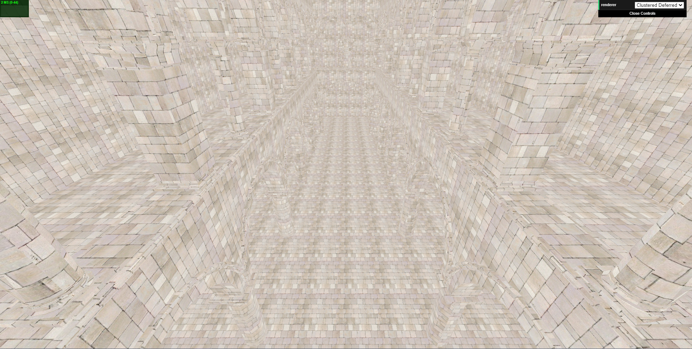
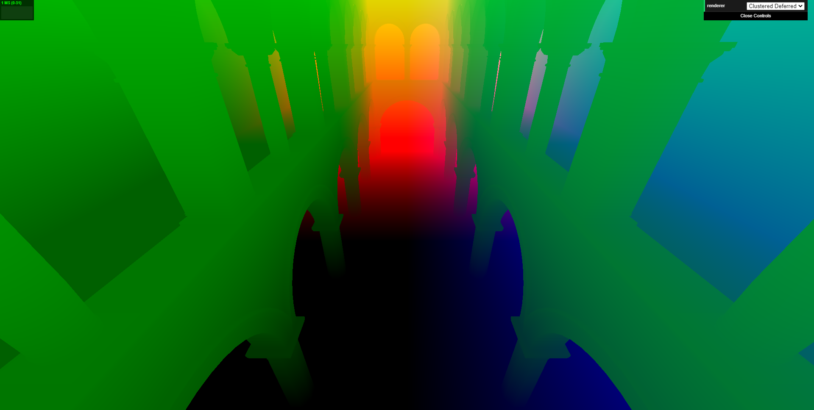
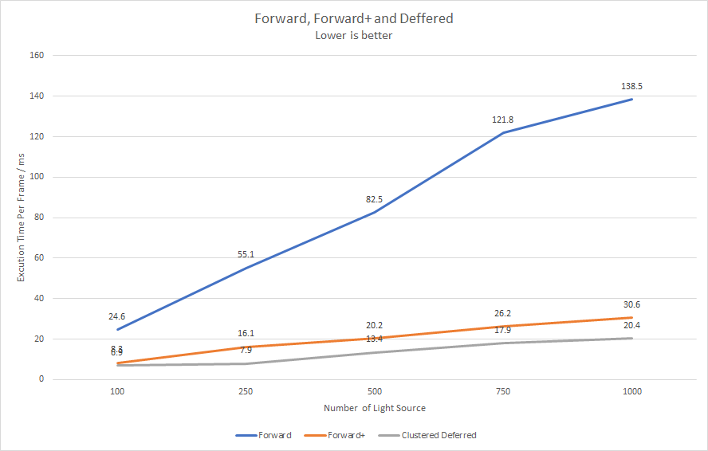
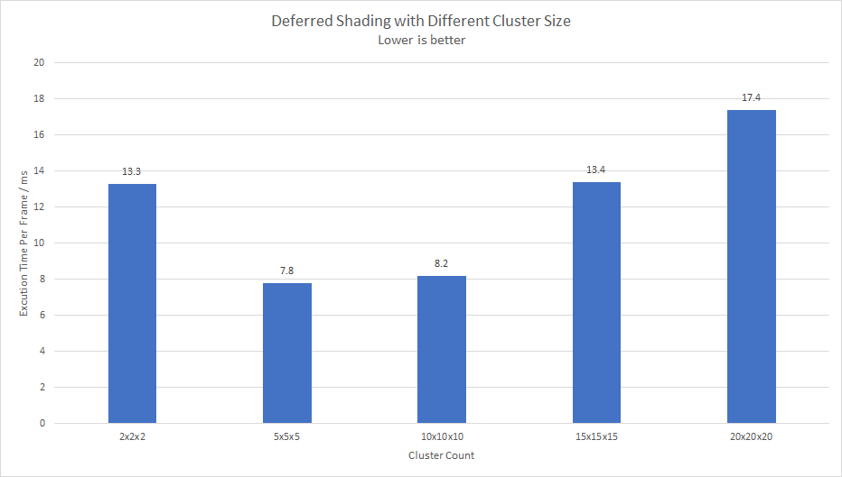
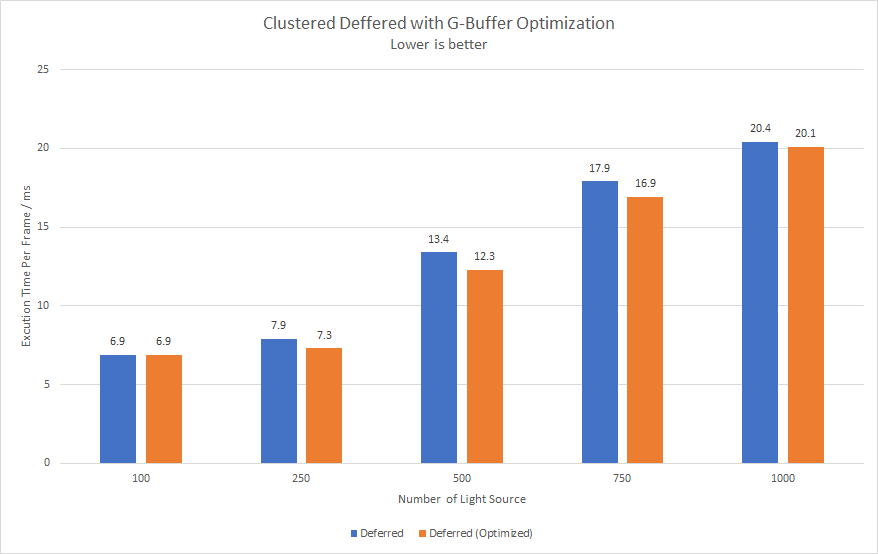
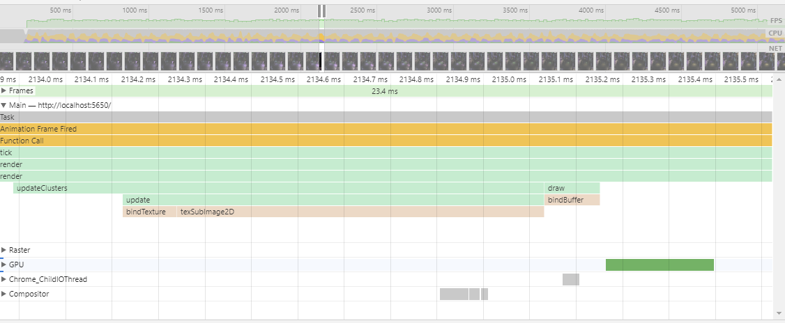

WebGL Forward+ and Clustered Deferred Shading
======================

**University of Pennsylvania, CIS 565: GPU Programming and Architecture, Project 5**

* Zijing Peng
* Tested on: Windows 10, i7-8750H@ 2.22GHz 16GB, NVIDIA GeForce GTX 1060 (laptop)

### Demo

[Live Demo](https://zijingpeng.github.io/Project5-WebGL-Forward-Plus-and-Clustered-Deferred/)

### Features

#### Clustering

Clusters are portions of the 3D space that correspond with tiles on 2D screen. To implement clustering, we divide the camera view frustum into multiple frustums. Each frustum is attached with a list of lights that intersect the frustum.

#### Forward+

Forward+ will render the scene using only the lights that overlap a given cluster. It will directly retrieve all the light from the cluster texture based on its current cluster index, and then calculate the light sources' contribution. 

#### Deferred

Deferred rendering has two passes. In the first pass, albedo, world position and normal are prepared and packed into the texture. In the second pass, those attributes are directly read from the texture to do the shading. Clustering is also added to the deferred rendering so that no need to calculate the contribution of all the light sources.

| Albedo              | Position              | Normal              |
| ------------------- | --------------------- | ------------------- |
|  |  |  |

#### Blinn-Phong shading

#### G-Buffer Optimization

I use 2-component normal for the G-Buffer and pack the values together with `position` and `albedo`. Thus, 2 vec4 is needed instead of 3 vec4. The encoding and decoding algorithm is referred to this [article](https://aras-p.info/texts/CompactNormalStorageOldWrong.html).

### Performance Analysis

##### Forward, Forward+ and Clustered Deferred Shading

The figure shows the performance of Forward, Forward+ and Clustered Deferred shading based on different number of light source. The profiling is done with the cluster count of 15x15x15. As can be seen, Clustered Deferred is the best one among the three.

##### How Cluster Size affect performance

The figure shows how the cluster size affect performance. The profiling is done with `lightCount = 500`. When there are more cluster, more time it takes to locate each light in the cluster, and a larger texture is needed to store the cluster. When there are less light, one cluster contains more light, so more iteration it needs to compute the contribution of all the lights. As can be seen, the best performance appears when the cluster size is close to 5x5x5. 

##### G-Buffer Optimizaition

As can be seen, the performance improved by applying the G-Buffer optimization. However, after optimization, the performance improvement is not too prominent, indicating that the bottleneck is not in this part. 

Based on the profiling, we can find `texSubImage2D` takes up long time. In clustered deferred shading we packs all the cluster with the lights into a texture of `(clustureSize, ceil(lightSize + 1) / 4 * sizeof(vec4))`, which becomes the bottleneck.

### Credit

* [Three.js](https://github.com/mrdoob/three.js) by [@mrdoob](https://github.com/mrdoob) and contributors
* [stats.js](https://github.com/mrdoob/stats.js) by [@mrdoob](https://github.com/mrdoob) and contributors
* [webgl-debug](https://github.com/KhronosGroup/WebGLDeveloperTools) by Khronos Group Inc.
* [glMatrix](https://github.com/toji/gl-matrix) by [@toji](https://github.com/toji) and contributors
* [minimal-gltf-loader](https://github.com/shrekshao/minimal-gltf-loader) by [@shrekshao](https://github.com/shrekshao)
