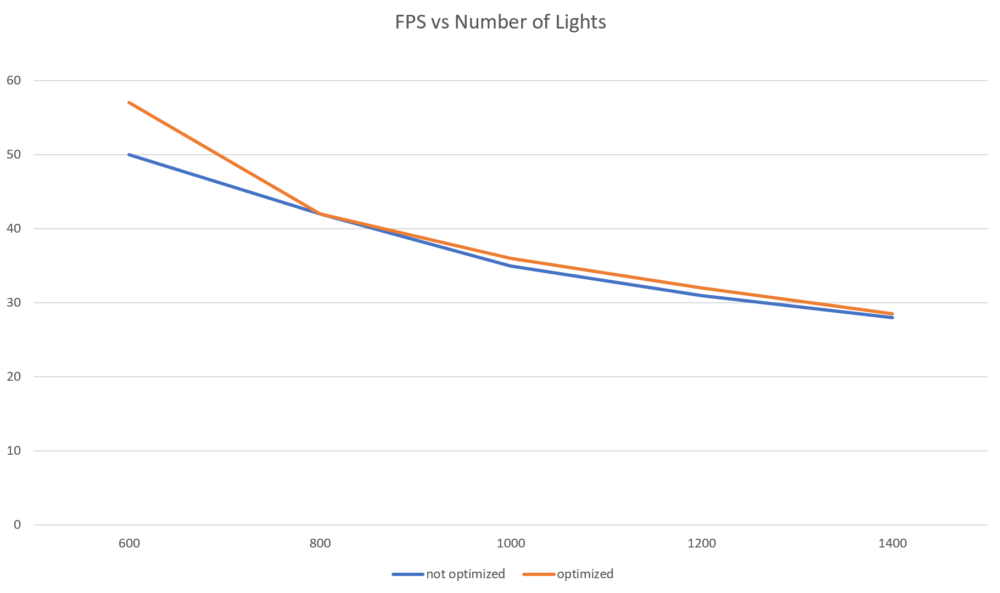
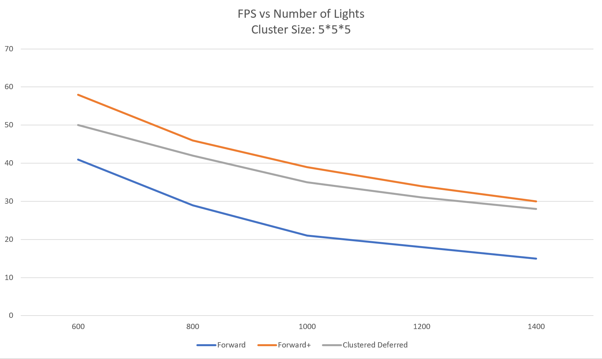
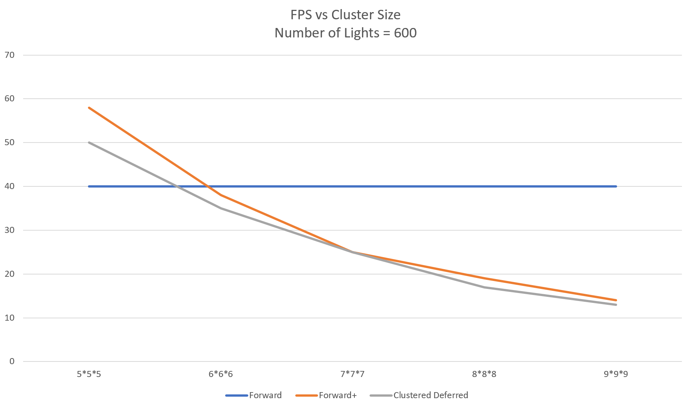
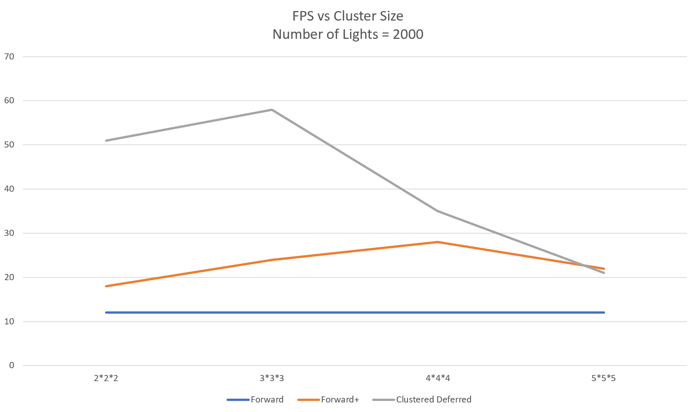
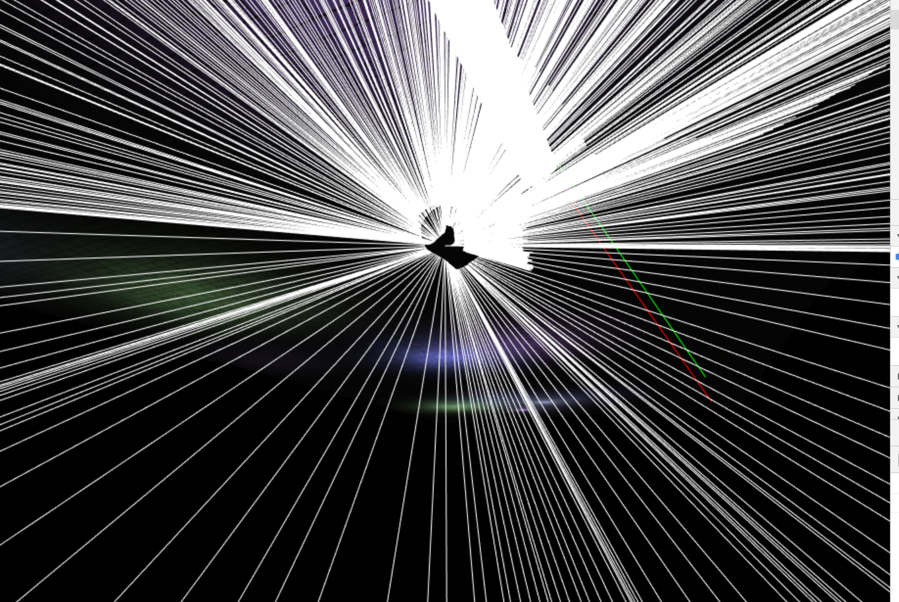
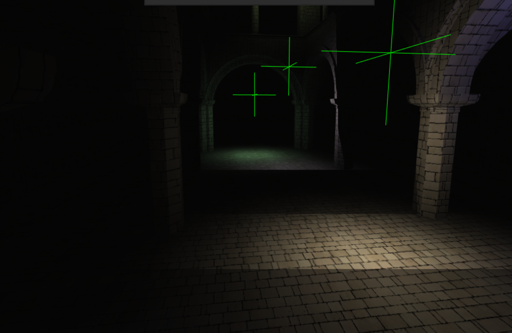

WebGL Forward+ and Clustered Deferred Shading
======================

**University of Pennsylvania, CIS 565: GPU Programming and Architecture, Project 5**
* Haorong Yang
* [LinkedIn](https://www.linkedin.com/in/haorong-henry-yang/)
* Tested on: Windows 10 Home, i7-10750H @ 2.60GHz 16GB, GTX 2070 Super Max-Q (Personal)

[Online Live Demo](https://yangh34.github.io/Project5-WebGL-Forward-Plus-and-Clustered-Deferred/)

### Demo Video/GIF

### Features
  * Forward+ Shading
  * Clustered Deferred Shading
  * Blinn Phong Shading
  * Optimize G-Buffer Format - 2-component normal
  
  
### Forward+

  
  
###  Clustered Deferred
Position          |   Normal
:-------------------------:|:-------------------------:
|  |

### Optimization

A 2-component normal was implemented to reduce the GBuffer number from 3 to 2 by storing the 2 components of the normal into the 4th components of the position and normal GBuffers. The method used to encode the 2-component normal references the

[Lambert Azimuthal Equal-Area projection](https://aras-p.info/texts/CompactNormalStorage.html#method04spheremap)

### Performance Analysis

It could be generally observed that the performance slows down with increase in light number.
When testing with a cluster size of 5*5*5, forward+ shading performs the best, followed by deferred shading. 
This is probably because deferred shading needs one more step of prepassing to generate gBuffers. However, this result is observed using a fixed cluster size. There could be differences when cluster size is changed.

FPS vs Cluster Size with 600 lights        |   FPS vs Cluster Size with 2000 lights
:-------------------------:|:-------------------------:
 |  |

I took two more ses of results. It could be observed that around 3*3*3 is a optimum cluster size for deferred shading. 

### Bloopers and Debug Images
  

### Credits

* [Three.js](https://github.com/mrdoob/three.js) by [@mrdoob](https://github.com/mrdoob) and contributors
* [stats.js](https://github.com/mrdoob/stats.js) by [@mrdoob](https://github.com/mrdoob) and contributors
* [webgl-debug](https://github.com/KhronosGroup/WebGLDeveloperTools) by Khronos Group Inc.
* [glMatrix](https://github.com/toji/gl-matrix) by [@toji](https://github.com/toji) and contributors
* [minimal-gltf-loader](https://github.com/shrekshao/minimal-gltf-loader) by [@shrekshao](https://github.com/shrekshao)
* [Compact Normal Storage for small G-Buffers](https://aras-p.info/texts/CompactNormalStorage.html#method03spherical)
