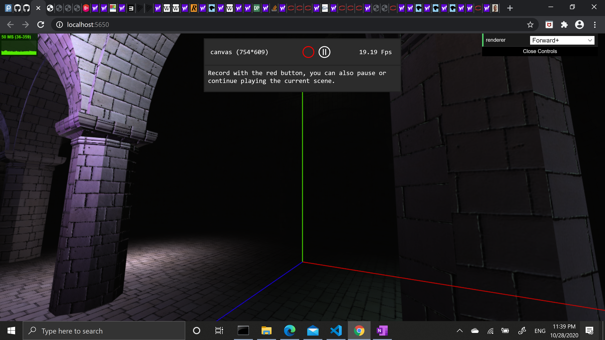
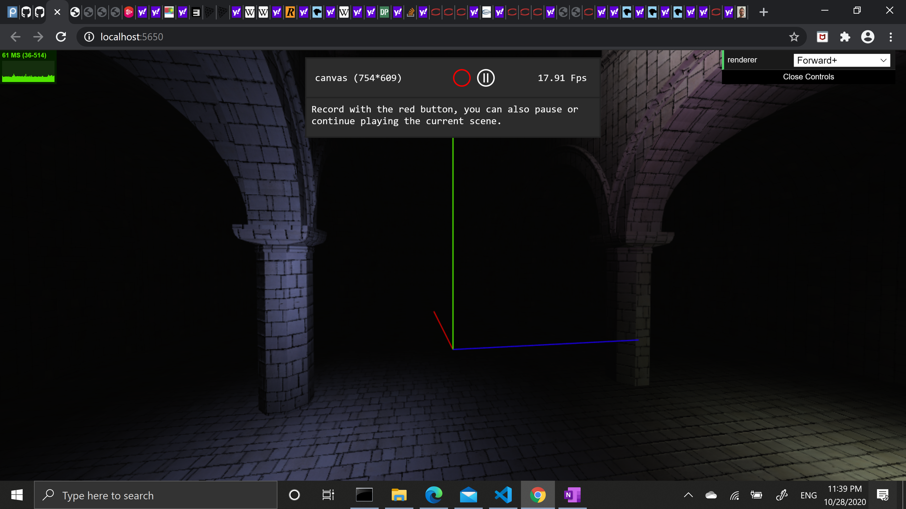
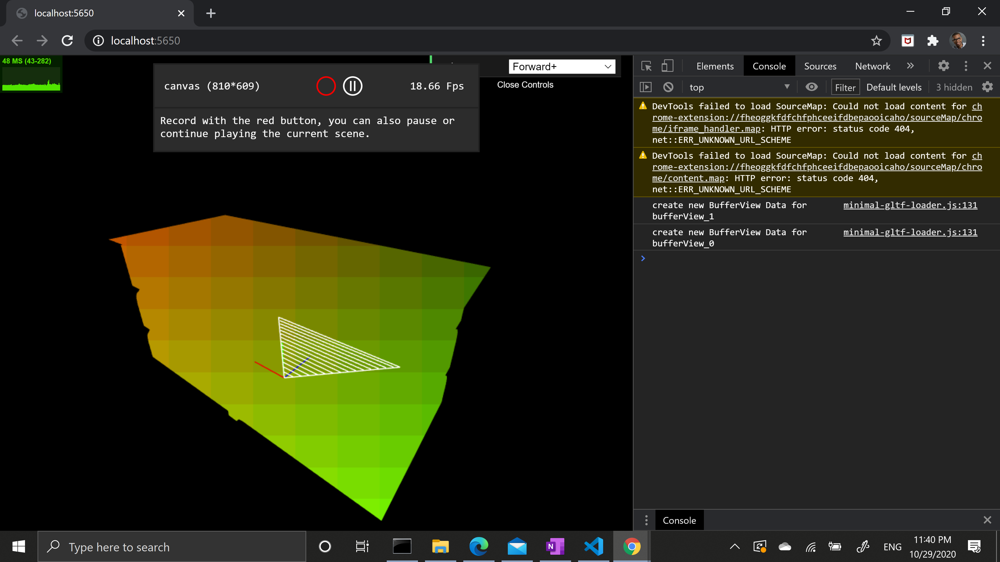
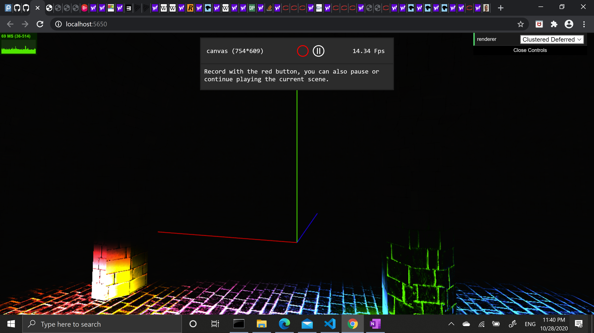
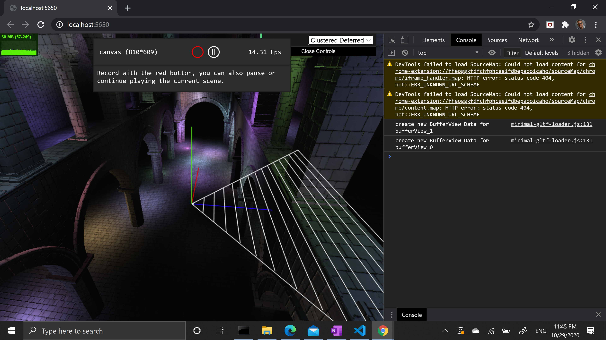

WebGL Forward+ and Clustered Deferred Shading
======================

**University of Pennsylvania, CIS 565: GPU Programming and Architecture, Project 5**

* Spencer Webster-Bass
* This is a WebGL and Javascript project showcasing different rasterizing techniques. These techniques are
  forward, forwrd plus, and clustered deferre shading.
* Tested on: **Google Chrome Version 86.0.4240.111 (Official Build) (64-bit)** on
  Windows Processor	Intel(R) Core(TM) i7-8565U CPU @ 1.80GHz, 1992 Mhz, 4 Core(s), 8 Logical Processor(s)

### Live Online

**Forward Plus Renders**

Visual debugging with frustum indices as inputs:

**Cluster Deffered Renders**

Blooper Image caused by accidentally overwriting light texture:

Final Render:

### Demo Video/GIF

https://drive.google.com/file/d/1e5ZsRN7bboK-4Bq249mDDDxN7u5Ogs0Q/view?usp=sharing

### Performance Analysis:

The Forward Plus Renderer fram rate varied drastically with a frame rate in between 90 and 110 for close up scenes that do not show much geometry to frame rates in between 38 and 57 for far away scenes that show a lot of the scene.

The Cluster Deferred Renderer performed slightly worse in the far away scene with a frame rate in between 47 and 50 while th eclose up scene varied widely from the 50s ro the 90s in frame rate.

It's hard to say what caused the difference in performance especially because my clustered deferred renderer is not correct or complete.

No new features added.

### Credits

* [Three.js](https://github.com/mrdoob/three.js) by [@mrdoob](https://github.com/mrdoob) and contributors
* [stats.js](https://github.com/mrdoob/stats.js) by [@mrdoob](https://github.com/mrdoob) and contributors
* [webgl-debug](https://github.com/KhronosGroup/WebGLDeveloperTools) by Khronos Group Inc.
* [glMatrix](https://github.com/toji/gl-matrix) by [@toji](https://github.com/toji) and contributors
* [minimal-gltf-loader](https://github.com/shrekshao/minimal-gltf-loader) by [@shrekshao](https://github.com/shrekshao)
