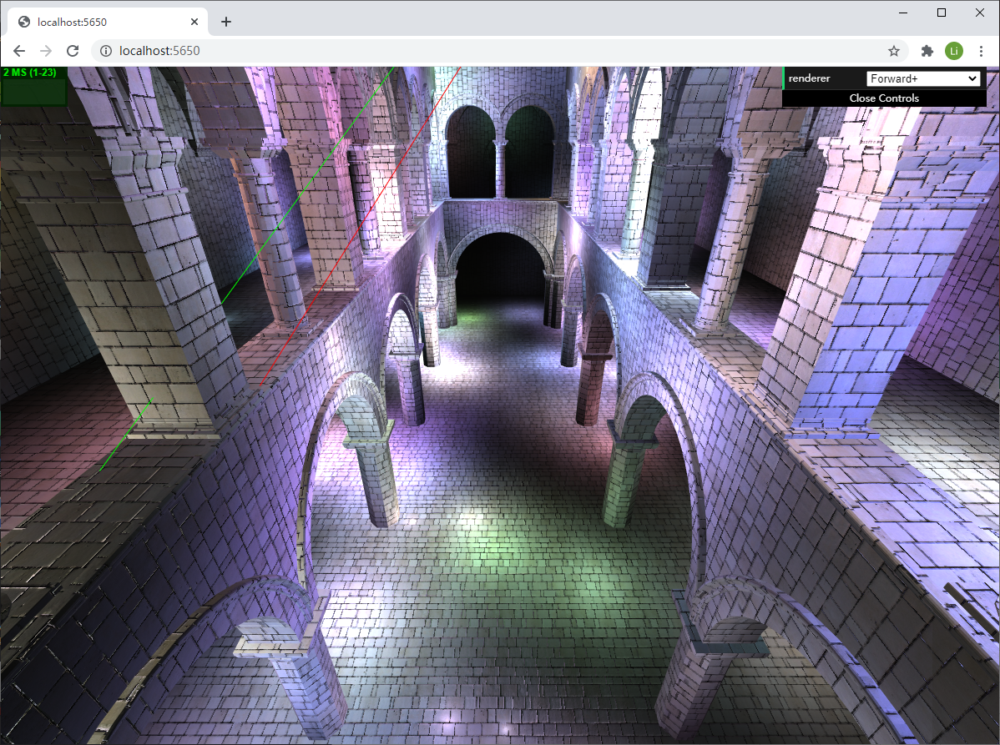
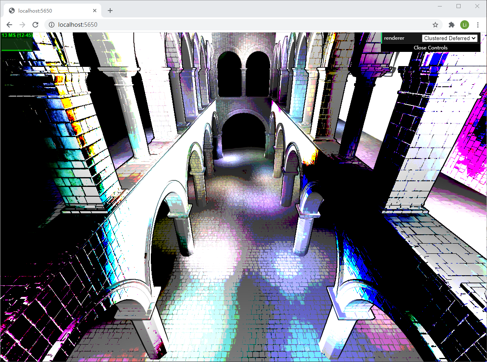
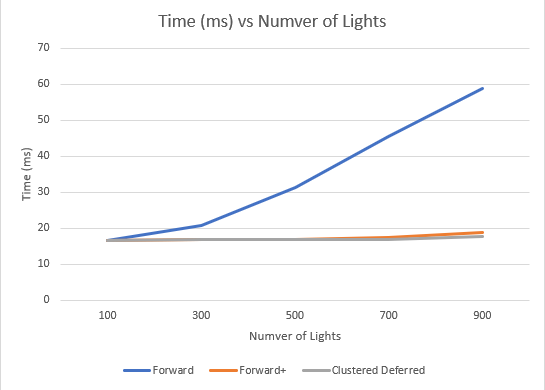
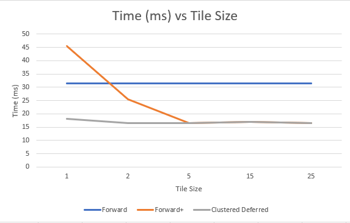
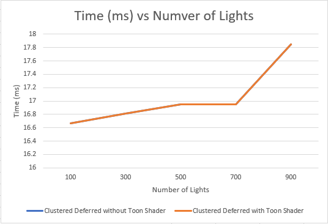
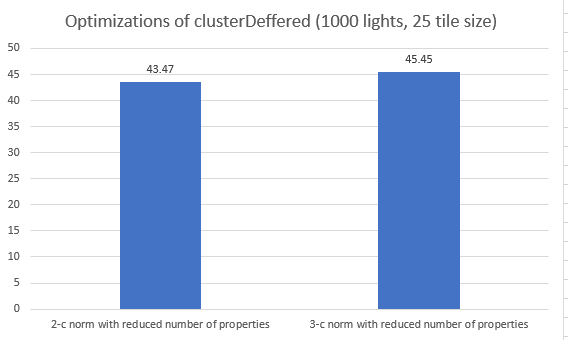

WebGL Forward+ and Clustered Deferred Shading
======================

**University of Pennsylvania, CIS 565: GPU Programming and Architecture, Project 5**

* Li Zheng
  * [LinkedIn](https://www.linkedin.com/in/li-zheng-1955ba169)
* Tested on: Windows CUDA10, i5-3600 @ 3.59GHz 16GB, RTX 2060 6GB (personal computer)

This project is aimed to analyze the shading performance of Forward, Forward+ and Clustered Deferred shading. Analyze the change of rendering time per frame with different effect and performance optimization features.  
Feature:
- Forward+
- Clustered Deferred
- Effects
- Optimizations

### Live Online

### Demo Video/GIF

### Performance & Analysis
#### Compare Forward+ and Clustered Deferred shading
Forward+ is faster if there are few lights and culled fragments. Otherwise, Clustered Deferred shading is faster. Farward+ shades all fragments. Clustered Deferred only shade fragments passing depth test. So the scene with large number of lights and culled fragments should have a better performance using Clustered Deferred shading. But Clustered Deferred takes more passes of texture to store geometries, witch result in relatively bad performance with few lights. Also, Clustered Deferred shading has limitations of material flexibility, no translucency and MSAA requires high memory usage. 

#### New Effect Features
I analyze the performance of shading with varying number of lights and tile size. For the Clustered Deferred shading, I implement a post processing of Toon shading.   

  
The figure show the time (ms) per frame of three different shading methods with increasing number of lights. Cluster Deferred Shading has the best performance. Forward+ comes next. The time of original Forward Shading increases proportionally with number of lights.  

  
As shown in this figure, very small tile size id bad for shading efficiency. Small tile size indicates large number of clusters, which take s high memory bandwith.  

  
Toon shading almost doesn’t affect the shading efficiency. It’s a kind of post processing, which is not directly affected by light number or tile size.  

#### New Performance Feature 
  
I tried two versions of optimizations for this part. Both of them implements pack of values into vec4 and only pass z component of vertex position. The first optimization uses 2-component normal. The other uses 3-component normal. The first optimization spends less time rendering per frame if there are large amount of lights in the scene. The figure shows the performance in scene with 1000 lights.  

### Credits

* [Three.js](https://github.com/mrdoob/three.js) by [@mrdoob](https://github.com/mrdoob) and contributors
* [stats.js](https://github.com/mrdoob/stats.js) by [@mrdoob](https://github.com/mrdoob) and contributors
* [webgl-debug](https://github.com/KhronosGroup/WebGLDeveloperTools) by Khronos Group Inc.
* [glMatrix](https://github.com/toji/gl-matrix) by [@toji](https://github.com/toji) and contributors
* [minimal-gltf-loader](https://github.com/shrekshao/minimal-gltf-loader) by [@shrekshao](https://github.com/shrekshao)
