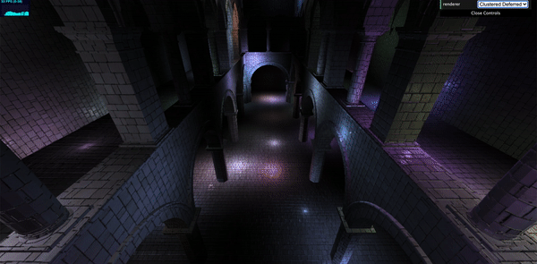
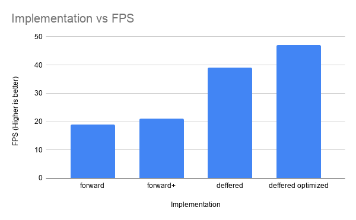
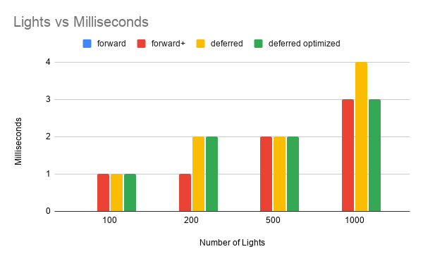

WebGL Forward+ and Clustered Deferred Shading
======================

**University of Pennsylvania, CIS 565: GPU Programming and Architecture, Project 5**

* Sydney Miller
  * [LinkedIn](https://www.linkedin.com/in/sydney-miller-upenn/)
* Tested on: GTX 222 222MB (CETS Virtual Lab)

### Live Online

### Demo Video/GIF

 

### README

#### Performance Analysis

 

Overall, each improvement increased the preformance slightly from the previous, which is what I expected to happen. Since the default number of lights in the scene is pretty large (100), Forward+ resutls and a performance increase. In addition, Clustered Deferred offers an even larger performance increase since it separates the lights from the scene. Finally, removing a buffer from the Clustered Deferred algorithm offers even more of a performance speed up since there are less befores to create, which takes less time. 

 

As the number of lights in the scene increased, the milisecond timing increased. In addition, the milisecond timing increased with each optimization. 

#### Forward+ 

 

The Forwad+ algorithm separatess the scene inito clusters in world space and marks all of the lights that intersect a cluster. The lights in the cluster that the fragment intersects then contribute to the fragment shading. The best case scenerio is only a few lights interesting each cluster, however, if every light in the scene interesct every cluster, then the there would not be major performance benifits. From performance testing, the Forward+ algorithm runs at 21 fps whereas the Forward algorithm runs at 19 fps. 

#### Clustered Deferred

 

The Clustered Deferred Algorithm writes information to GBuffers about position, normal, and color and then does a second pass where it lights the scene based on these values. This second pass is done once per light. Since lighting is done as a second pass, this technique is great when there is a lot of geometry in the scene. Using multiple buffers can lead to more memory usage, however. In my experiments, this technique resulted in a much better performace of 39 fps whereas the Forward algorithm runs at 19 fps. 

#### Clustered Deferred Blinn-Phong Shading

Blinn-Phong Shading adds a shininess to the scene. This implementation resulting in an fps of 35 when running on the un-optiimized clustered deferred algorithm, which is a slightly worse performance than the normal clustered Deferred. I referenced this source for the blinn-phong equation [Blinn-Phong Source](https://learnopengl.com/Advanced-Lighting/Advanced-Lighting).

#### Clustered Deferred Optimized

 

The Clustered Deferred Optimized Algorithm improves on the clustered deferred algorithm by storing the x and y values of the normal in the 4th spots of the position and color buffers, meaning that only two bufferes are needed instead of three. The normal is then reconstructed in the shader knowing that the magnitude of the normal should be one. The decrease in buffers led to a significant performance increase of 47 fps compared to 39 fps from Clustered Deferred. 

### Credits

* [Three.js](https://github.com/mrdoob/three.js) by [@mrdoob](https://github.com/mrdoob) and contributors
* [stats.js](https://github.com/mrdoob/stats.js) by [@mrdoob](https://github.com/mrdoob) and contributors
* [webgl-debug](https://github.com/KhronosGroup/WebGLDeveloperTools) by Khronos Group Inc.
* [glMatrix](https://github.com/toji/gl-matrix) by [@toji](https://github.com/toji) and contributors
* [minimal-gltf-loader](https://github.com/shrekshao/minimal-gltf-loader) by [@shrekshao](https://github.com/shrekshao)
