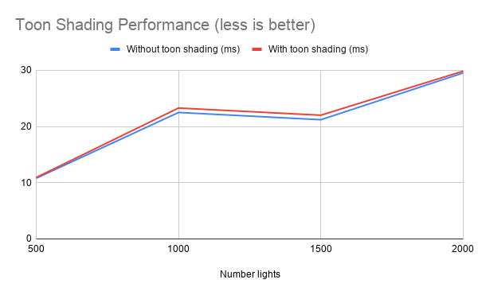
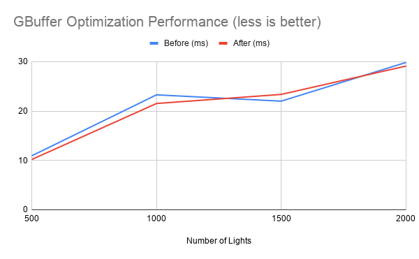

WebGL Forward+ and Clustered Deferred Shading
======================

**University of Pennsylvania, CIS 565: GPU Programming and Architecture, Project 5**

* Hanyu Liu
  - [personal website](http://liuhanyu.net/) 
* Tested on: Google Chrome 222.2 on Windows 10, Intel(R) Core(TM) i7-7700HQ CPU @ 2.80GHz 16.0GB, GeForce GTX 1050 (Personal)

### Live Online

### Demo Video/GIF

Go to this [link](https://drive.google.com/file/d/1nAsBnDjN-ts7UiXzlpAYl7AWSopCxcTp/view?usp=sharing). (File too big to upload)

### Features & Analysis

This project compares many different rendering methods including Forward and Deferred for a scene that has many moving lights, each with their own spheres of influence. 

The most basic renderer is the **Forward renderer**. Here, every light is considered for every single fragment, making the overall process very slow in a scene with many lights. 

To improve upon this, a **Forward+ renderer** was implemented, which introduced a new data structure called clusters, which stored the number and indices of lights inside every cluster. This way, instead of iterating through all the lights, we only factor in the lights that fall within the clusters affected by the light and its sphere of influence. 

In addition, a **Deferred Cluster renderer** was also implemented. This rendering method saves the necessary values of every fragment and stores them in a gbuffer. Then, in another shader pass, we read from this buffer and factor in all the lights. Essentially, we are delaying the light calculation process until all the visible fragments are produced. This way, we only have to evaluate light contributions for the number of pixels on the screen instead of every single fragment. 

Finally, a **Toon Rendered** was made for fun, to create a cartoon/comic looking scene. The toon renderer was based off the deferred cluster rendering technique. Here, the colors are scaled up, floored, then scaled back down in order to create large color intervals/ramps. Then, a procedurally generated layer of dots were added on top, giving the scene a more comic/printed feel. Finally, edges were detected based on the cross product of the normals and view vector, and they were colored a darker color, making the scene look like it's outlined!

To compare the performances of these rendering methods...

Here we see that overall, the deferred rendering processes were faster than the forward rendering processes. This is especially true in a scene with many lights...

This is because with more lights, the complexity of evaluating every single fragment dramatically increases. If we defer the light calculation, the number of fragments evaluated stays low, and only the lights go up. 

Thus, in a scene with many lights, the deferred rendering method is more effective. However, at very few lights, we see that the deferred method is the same if not more expensive than the forward+ method. This is because we need to initialize, fill, and extract gbuffers, which may be slower and will take up a lot more memory.

To speed up performance, I optimized gbuffers to use only 2 buffers instead of 4. To do this, I packed 3 floats into 2. More specifically, I packed the vec3 normal data into a vec2, filled all vec4s of the gbuffer with values, and unpacked it in the next shader pass. With this optimization...

we see that the packed gbuffers are a bit faster now than the unpacked gbuffers!

### Bloopers

### Credits

* [Three.js](https://github.com/mrdoob/three.js) by [@mrdoob](https://github.com/mrdoob) and contributors
* [stats.js](https://github.com/mrdoob/stats.js) by [@mrdoob](https://github.com/mrdoob) and contributors
* [webgl-debug](https://github.com/KhronosGroup/WebGLDeveloperTools) by Khronos Group Inc.
* [glMatrix](https://github.com/toji/gl-matrix) by [@toji](https://github.com/toji) and contributors
* [minimal-gltf-loader](https://github.com/shrekshao/minimal-gltf-loader) by [@shrekshao](https://github.com/shrekshao)
