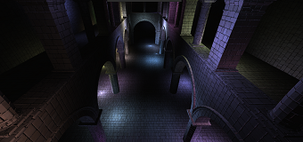

WebGL Forward+ and Clustered Deferred Shading
======================

**University of Pennsylvania, CIS 565: GPU Programming and Architecture, Project 5**

* Xuanyi Zhou
* Tested on: **Google Chrome 86.0.4240.111 with `--enable-webgl2-compute-context --use-angle=gl --use-cmd-decoder=passthrough`** on
  Windows 10, i7-9750H @ 2.60GHz 32GB, RTX 2060 6GB

### Demo (click to visit page)

The scene contains 1000 lights.

## Features

- Proper forward+ and clustered deferred rendering using WebGL2 compute shaders
  - Special command line flags are required to enable `webgl2-compte` contexts for chrome. Refer to https://github.com/9ballsyndrome/WebGL_Compute_shader/blob/master/README.md for how to enable `webgl2-compute` and to test if it's properly enabled.
- Debug views
  - Debug view 1: Depth/cluster visualization
  - Debug view 2: Visualization of number of lights shaded per pixel
  - Debug view 3: (Only for clustered deferred) Toon shaded view
- Toon shading (ended up being really ugly due to normal mapping)

### Credits

* [Three.js](https://github.com/mrdoob/three.js) by [@mrdoob](https://github.com/mrdoob) and contributors
* [stats.js](https://github.com/mrdoob/stats.js) by [@mrdoob](https://github.com/mrdoob) and contributors
* [webgl-debug](https://github.com/KhronosGroup/WebGLDeveloperTools) by Khronos Group Inc.
* [glMatrix](https://github.com/toji/gl-matrix) by [@toji](https://github.com/toji) and contributors
* [minimal-gltf-loader](https://github.com/shrekshao/minimal-gltf-loader) by [@shrekshao](https://github.com/shrekshao)
* https://github.com/9ballsyndrome/WebGL_Compute_shader
