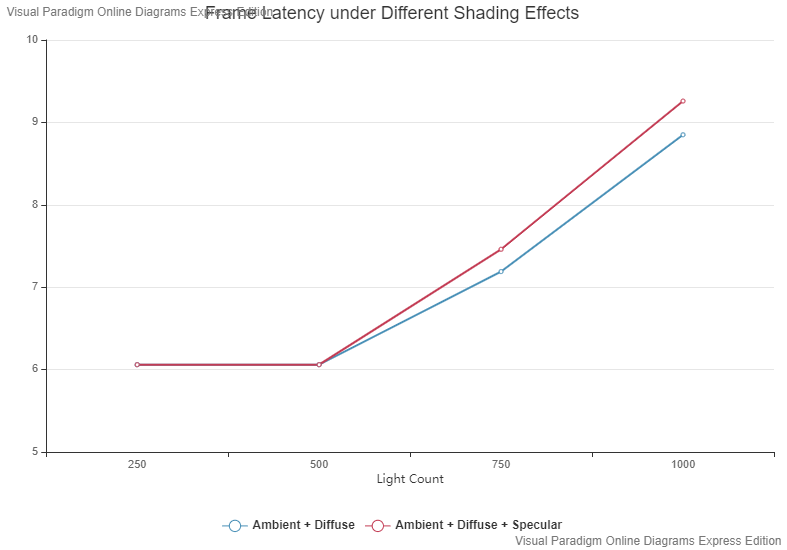

WebGL Forward+ and Clustered Deferred Shading
======================

**University of Pennsylvania, CIS 565: GPU Programming and Architecture, Project 5**

* Xuecheng Sun
* Tested on: (TODO) **Google Chrome 86.0.4240.111 64bits** on
  Windows 10, R7 3700X @ 3.9GHz, 32GB, RTX 2070 super 8GB 

### Live Online

https://hehehaha12139.github.io/Project5-WebGL-Forward-Plus-and-Clustered-Deferred/

### Demo Video/GIF

https://youtu.be/h7AgPwpVVl0

### Features Implemented

Forward+ Rendering and Clustered Deferred Rendering

Blinn-Phong Rendering

Optimization 1: Pack Values together into vec4s 

Optimization 2: Two-component Normals 

Optimization 3: World Space Position Reconstruction

### Benchmarks

**Different Rendering Methods**

In the benchmark, we can see that with the growth of light numbers, the performance gap between three methods are bigger and bigger.  It seems that Deferred rendering always have the best performance in speed.

**Different Shadings with Deferred Rendering**

In this benchmark, I compare the performance between Phong shading and Blinn-Phong Shading. Because I add more computations in shader, the final performance always have a constant gap between two methods. Because the max frame rate is locked to 165Hz, so when the light count is 250 and 500, there is no gap between two methods.

**Optimization**

Because the max frame rate is 165Hz, it is unnecessary to compare performance when the light count is below 750.  In this benchmark, we can see optimized method always have a slight performance improvement compared to the unoptimized version.

### Credits

* [Three.js](https://github.com/mrdoob/three.js) by [@mrdoob](https://github.com/mrdoob) and contributors
* [stats.js](https://github.com/mrdoob/stats.js) by [@mrdoob](https://github.com/mrdoob) and contributors
* [webgl-debug](https://github.com/KhronosGroup/WebGLDeveloperTools) by Khronos Group Inc.
* [glMatrix](https://github.com/toji/gl-matrix) by [@toji](https://github.com/toji) and contributors
* [minimal-gltf-loader](https://github.com/shrekshao/minimal-gltf-loader) by [@shrekshao](https://github.com/shrekshao)
