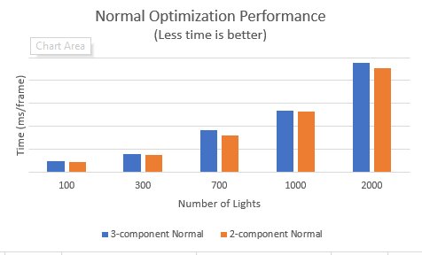

WebGL Forward+ and Clustered Deferred Shading
======================

**University of Pennsylvania, CIS 565: GPU Programming and Architecture, Project 5**

* Keyi Yu
  * [LinkedIn](https://www.linkedin.com/in/keyi-linda-yu-8b1178137/)
* Tested on: Windows 10, i7-10750H @ 2.60GHz 16GB, GeForce RTX 2070 with Max-Q 8228MB (My Machine)

### Live Online

[](https://lindayukeyi.github.io/Project5-WebGL-Forward-Plus-and-Clustered-Deferred/)

### Demo Video/GIF


### Features
**Clustered Rendering**

The basic idea of clustering is deviding the frustum into x * y * z 3D clusters and assigning the lights to those clusters. In this way, we can easily get all the lights instead of iterating every lights in the fragment shader. One tricky thing here is to check the intersection of the clusters and point light. The clusters are the small frustums with different sizes.

**Forward+ shading**

In forward+ fragment shader, I have to invert the fragment coordinate to the indices of clusters. Then I get some information from the texture buffer like the number of lights in a cluster and their indices.

**Deferred Shading**

Deferred shading has two steps. The first step is to write position, color and normal information to a g-buffer. The second step is to find light in clustered texture and then do light shading.

Albedo            |  Normal | Position
:-------------------------:|:-------------------------:|:-------------------------:
 |  | 

**Blinn-phong**

This is a common specular lighting model.
```
S = max(dot(H, N), shininess), 0) * specular color, where H = (V + L) / 2
final color = ambient  + S
```

No Blinn-Phong            |  Blinn-Phong
:-------------------------:|:-------------------------:
 | 

**2-component Normal**

Instead of using an extra vec4 g-buffer to store the normal information. I pack the information like this
```
vec4 gb0 = vec4(position, normal.x);
vec4 gb1 = vec4(col, normal.y)
```
Because the length of a normal is 1, I can extract the z value from x and y value by calulating the square root of (1 - x^2 - y^2). Bacause the value of color is always positive, I use the color information to represent the sign of z value. If the color value is negative, I will multiply the square root by -1.0.

### Performance Analysis
**Forward(F) vs Forward+(F+) vs Deferred Clustering(DC)**
1. Number of lights

In every test, the performance is the same: DC > F+ > F. As the number of lights increases, DC greatly outperforms the other two. In the first graph, DC and F
\+ are not affected by the number of lights because the max number of lights in the cluster is a constant. In contrast, as shown in the second graph, if the max number of lights in a cluster changes along with the number of lights, DC and F+ will also be similarly impacted but they will increase at a slower rate.


2. Tiles

Since large tiles can have more lights, each fragment will check more lights. Small tiles also have more memory usage since each has a light of indices for overlapping lights.


3. Light raduis

F wins this time. F is not impacted by the radius of light but F+ and DC are greatly impacted. As the raduis increases, F+ and DC slows down. When the raduis is 20, F outperforms F+. The reason why they slow down is that each cluster will have more lights which means the fragment have to check more lights.


**2-Component normal**

The optimized 2-component normal is slightly better than the 3-component one. Although we can save some memory space and data transfer time, it will cost some time to do the float-pointing computation. I just use a straightforward method to compute the z value from x and y using square root. So the result is a little bit blotchy. I could use a more complex encoding and decoding algorithm and I guesss this will cost more time.



### Bloopers


### Credits

* [Three.js](https://github.com/mrdoob/three.js) by [@mrdoob](https://github.com/mrdoob) and contributors
* [stats.js](https://github.com/mrdoob/stats.js) by [@mrdoob](https://github.com/mrdoob) and contributors
* [webgl-debug](https://github.com/KhronosGroup/WebGLDeveloperTools) by Khronos Group Inc.
* [glMatrix](https://github.com/toji/gl-matrix) by [@toji](https://github.com/toji) and contributors
* [minimal-gltf-loader](https://github.com/shrekshao/minimal-gltf-loader) by [@shrekshao](https://github.com/shrekshao)
