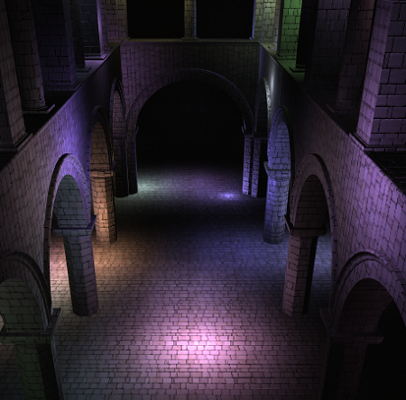

WebGL Forward+ and Clustered Deferred Shading
======================

**University of Pennsylvania, CIS 565: GPU Programming and Architecture, Project 5**
* Thy (Tea) Tran 
  * [LinkedIn](https://www.linkedin.com/in/thy-tran-97a30b148/), [personal website](https://tatran5.github.io/), [email](thytran316@outlook.com)
* Tested on: Google Chrome, Version 86.0.4240.183 (Official Build) (64-bit) on Windows 10, i7-8750H @ 2.20GHz 22GB, GTX 1070

### Live Online

### Demo Video/GIF

### Features

**Forward plus**
**Clustered deferred shading**
  - Reuse clustering logic from  with optimizations
  - Store vertex attributes in g-buffers 
     - Position, albedo color and normal
  - Red g-buffer in a shader to produce final output

**Blinn-Phong shading for point lights** (deferred shading)

**Optimizations for g-buffers by using 2-component normals**
  - By storing 2-components of a normal, we can estimate the remaining component by 'normal.z = sqrt(1 - pow(normal.x, 2) - pow(normal.y, 2))' because the normals are normalized. However, this is clearly not perfect, since the third component can originally be positive or negative, but we can't have that exact info when re-constructing the third component. There are some details lost as a result. Another noticeable artifact is the occasional random black specs in the renders.
  
|Normals (ground truth) | Normals (z reconstructed) | 
|---|---|---|
|||

Deferred shading (ground truth) | Deferred shading (z-reconstructed)|Black specs|
|---|---|---|
||||

### Performance & Analysis 

### Credits

* [Three.js](https://github.com/mrdoob/three.js) by [@mrdoob](https://github.com/mrdoob) and contributors
* [stats.js](https://github.com/mrdoob/stats.js) by [@mrdoob](https://github.com/mrdoob) and contributors
* [webgl-debug](https://github.com/KhronosGroup/WebGLDeveloperTools) by Khronos Group Inc.
* [glMatrix](https://github.com/toji/gl-matrix) by [@toji](https://github.com/toji) and contributors
* [minimal-gltf-loader](https://github.com/shrekshao/minimal-gltf-loader) by [@shrekshao](https://github.com/shrekshao)
